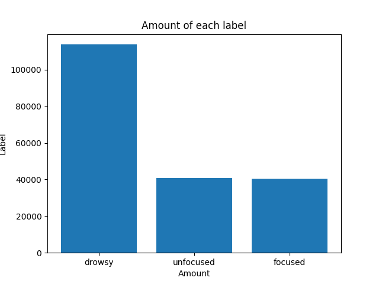
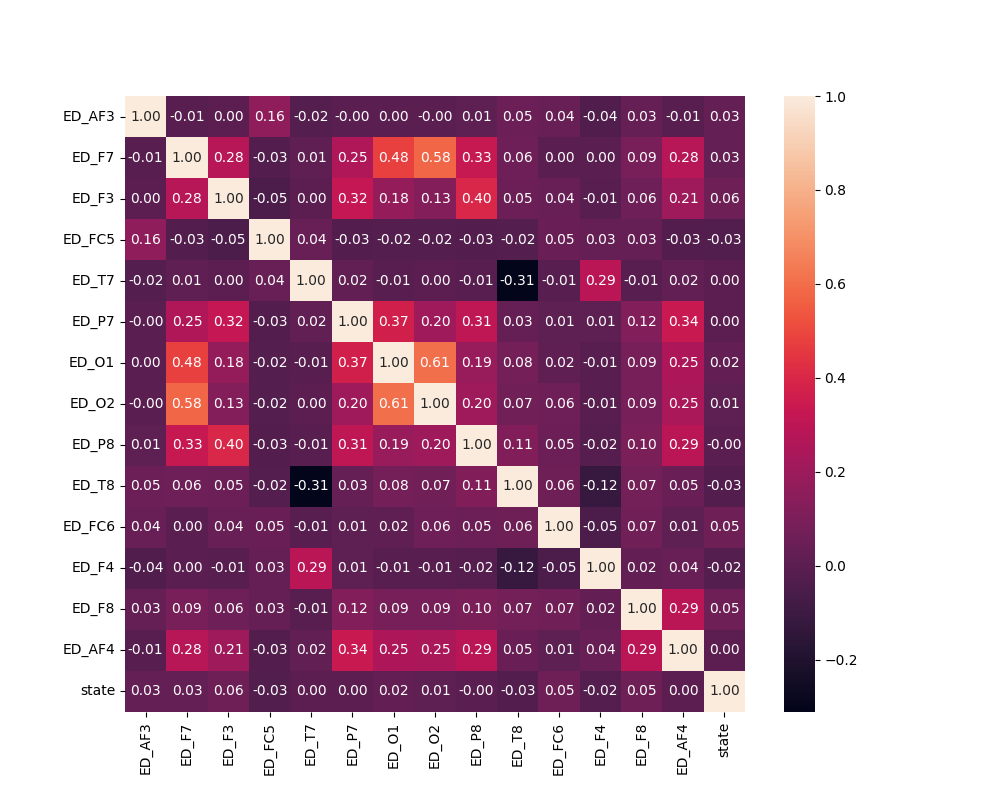
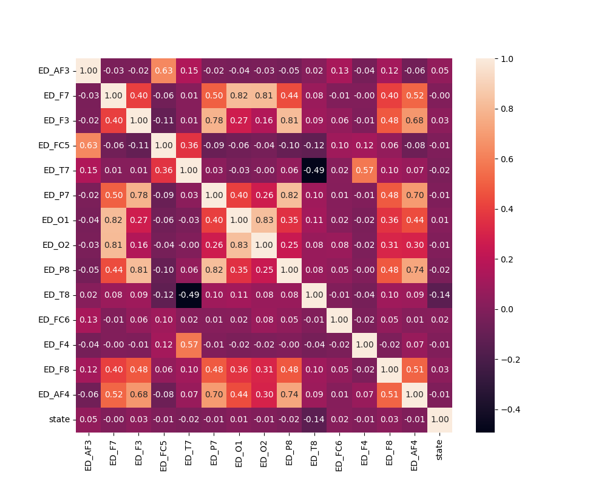
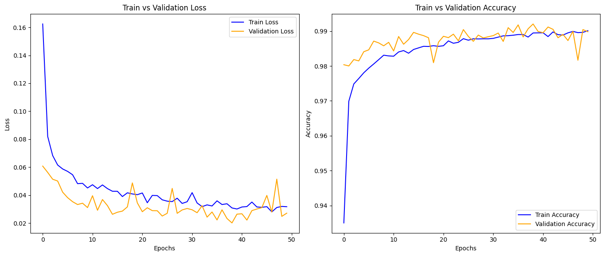
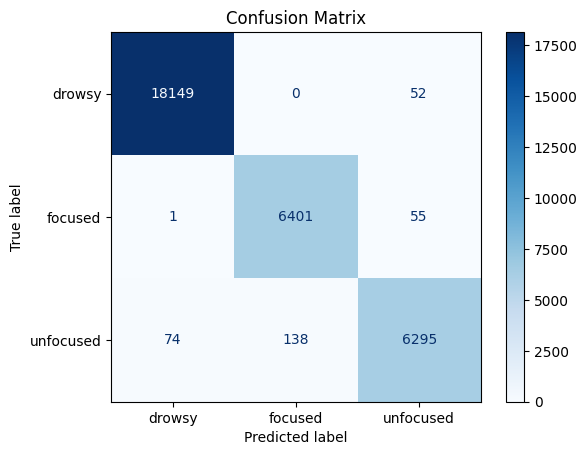
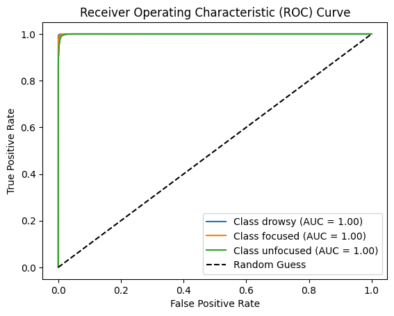
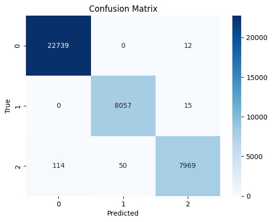
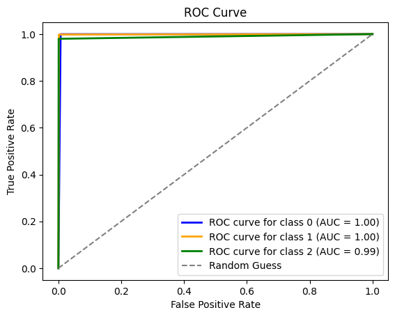

# Midterm Project: Mental Attention States Classification Using EEG Data

# Table of Contents

- [Midterm Project: Mental Attention States Classification Using EEG Data](#midterm-project-mental-attention-states-classification-using-eeg-data)
- [Table of Contents](#table-of-contents)
- [1. Project Overview](#1-project-overview)
  - [1.1. What is EEG?](#11-what-is-eeg)
  - [1.2. Experiment in project](#12-experiment-in-project)
  - [1.3. Dataset](#13-dataset)
  - [1.4. Main stages of the project](#14-main-stages-of-the-project)
- [2. Data Preprocessing](#2-data-preprocessing)
  - [2.1. High-pass filter](#21-high-pass-filter)
  - [2.2. Re-reference (Common Average Reference)](#22-re-reference-common-average-reference)
  - [2.3. Independent Component Analysis](#23-independent-component-analysis)
- [3. Feature Extraction](#3-feature-extraction)
  - [3.1. Fourier Transform](#31-fourier-transform)
  - [3.2. Wavelet Transform](#32-wavelet-transform)
  - [3.3. Deriving Features from the Frequency Domain](#33-deriving-features-from-the-frequency-domain)
- [4. Modeling](#4-modeling)
  - [4.1. Basic Models](#41-basic-models)
    - [4.1.1. Linear Discriminant Analysis (LDA)](#411-linear-discriminant-analysis-lda)
      - [4.1.1.1. Introduction](#4111-introduction)
      - [4.1.1.2. Why LDA Should Be Used for EEG Datasets](#4112-why-lda-should-be-used-for-eeg-datasets)
    - [4.1.2. Logistic Regression](#412-logistic-regression)
      - [4.1.2.1. Theory of Logistic Regression](#4121-theory-of-logistic-regression)
      - [4.1.2.2. Reasons for Choosing Logistic Regression](#4122-reasons-for-choosing-logistic-regression)
    - [4.1.3. Support Vector Machine (SVM)](#413-support-vector-machine-svm)
      - [4.1.3.1. Theory of Linear SVC](#4131-theory-of-linear-svc)
      - [4.1.3.2. Handling Multiclass Classification with Linear SVC](#4132-handling-multiclass-classification-with-linear-svc)
      - [4.1.3.3. Why LinearSVC should be used for EEG Datasets](#4133-why-linearsvc-should-be-used-for-eeg-datasets)
    - [4.1.4. Boosting](#414-boosting)
      - [4.1.4.1. Gradient Boosting](#4141-gradient-boosting)
      - [4.1.4.2. XGBoost](#4142-xgboost)
      - [4.1.4.3. LightGBM](#4143-lightgbm)
      - [4.1.4.4. Why Boosting should be used for EEG Datasets](#4144-why-boosting-should-be-used-for-eeg-datasets)
    - [Feature Selection and Training Models](#feature-selection-and-training-models)
      - [1. Introduction](#1-introduction)
      - [2. Overview](#2-overview)
      - [3. Detailed Explanation](#3-detailed-explanation)
  - [4.2. Advanced Models](#42-advanced-models)
    - [4.2.1. Multi-layer Perceptron (MLP)](#421-multi-layer-perceptron-mlp)
      - [4.2.1.1. Introduction](#4211-introduction)
      - [4.2.1.2. Why Multi-layer Perceptron (MLP) Should Be Used for EEG Datasets](#4212-why-multi-layer-perceptron-mlp-should-be-used-for-eeg-datasets)
    - [4.2.2. EEGNet](#422-eegnet)
      - [4.2.2.1. Theory of EEGNet](#4221-theory-of-eegnet)
      - [4.2.2.2. Parameters](#4222-parameters)
      - [4.2.2.3. Why EEGNet should be used for EEG Datasets](#4223-why-eegnet-should-be-used-for-eeg-datasets)
- [5. Model Evaluation](#5-model-evaluation)
  - [5.1. Visualization](#51-visualization)
  - [5.2 Metrics Selection](#52-metrics-selection)
  - [5.3 Base model](#53-base-model)
  - [5.3. Advanced Model](#53-advanced-model)
    - [5.3.1. Multi-layer Perceptron (MLP)](#531-multi-layer-perceptron-mlp)
      - [5.3.1.1. Training and Validation History](#5311-training-and-validation-history)
      - [5.3.1.2. Confusion Matrix](#5312-confusion-matrix)
      - [5.3.1.3. Detailed Evaluation of the Table Results](#5313-detailed-evaluation-of-the-table-results)
      - [5.3.1.4. ROC curve](#5314-roc-curve)
    - [5.3.2. EEGNet](#532-eegnet)
      - [5.3.2.1 Confusion Matrix](#5321-confusion-matrix)
      - [5.3.2.2. Detailed Evaluation of the Table Results](#5322-detailed-evaluation-of-the-table-results)
      - [5.3.2.3 ROC curve](#5323-roc-curve)
- [Conclusion](#conclusion)
- [Potential Improvement](#potential-improvement)

# 1. Project Overview

Project **Mental Attention States Classification Using EEG Data**, classify mental attention states (focused, unfocused, drowsy) based on EEG signals using machine learning techniques.

## 1.1. What is EEG?

EEG (Electroencephalogram) is a method of measuring and recording the electrical activity of the brain through electrodes placed on the scalp. These electrical signals reflect the activity of nerve cells in the brain as they transmit information. EEG is commonly used in medicine to diagnose neurological disorders such as epilepsy, dementia, or sleep-related issues, as well as in brain research. The EEG signals are recorded as brain waves with different frequencies and amplitudes, which can be categorized into types such as alpha, beta, delta, and theta waves.

## 1.2. Experiment in project

The experiments were conducted between 6 PM and 7 PM. The details of the experiments are given below (Authors):

Participants controlled a simulated passenger train over a primarily featureless route for a duration of 35 to 55 minutes. Specifically, during the first 10 minutes of each experiment, the participants were engaged in focused control of the simulated train, paying close attention to the simulator’s controls, and following the developments on the screen in detail. During the second 10 minutes of the experiments, the participants stopped following the simulator and became de-focused. The participants did not provide any control inputs during that time and stopped paying attention to the developments on the computer screen; however, they were not allowed to close their eyes or drowse. Finally, during the third 10 minutes of the experiments, the participants were allowed to relax freely, close their eyes and doze off, as desired.

**Experiment pitfall**

The experiment only had 5 subjects, and had been conducted for 7 days. Each record contains one EEG data each subject each day, except for one, who didn't joined in the last day. Hence, there are $7 \times 5 - 1 = 34$ records in total.

Since there are only 5 subjects, the data is hugely biased toward them. If you want to use the result in this report to generalize further, please use it with caution.

## 1.3. Dataset

The dataset used in this study is available for access on Kaggle. It is titled "EEG Data for Mental Attention State Detection" and contains various records related to EEG signals, specifically designed to analyze mental attention states. You can access and download the dataset using the following link: [EEG Data for Mental Attention State Detection on Kaggle](https://www.kaggle.com/datasets/inancigdem/eeg-data-for-mental-attention-state-detection/data).

This dataset consists of 34 experiments designed to monitor the attention state of human participants using passive EEG BCI (Brain-Computer Interface). Each Matlab file in the dataset contains data acquired from an EMOTIV device during a single experiment. The raw data is stored in the variable `o.data`, which is an array of size $\{\text{number-of-samples}\} \times 25$. Each column of `o.data` (i.e., `o.data(:,i)`) corresponds to one data channel.

The sampling frequency of the data is 128 Hz. In `o.data`, it has the list of columns provided below:

| ID   | Channel Name        | Meaning                                                |
| ---- | ------------------- | ------------------------------------------------------ |
| 1    | `'ED_COUNTER'`      | Counter for collected data samples.                    |
| 2    | `'ED_INTERPOLATED'` | Data interpolation state.                              |
| 3    | `'ED_RAW_CQ'`       | Raw data quality from sensors.                         |
| 4–17 | EEG Channels        | Channels containing EEG data (electroencephalography). |
| 18   | `'ED_GYROX'`        | Data from gyroscope sensor (X-axis).                   |
| 19   | `'ED_GYROY'`        | Data from gyroscope sensor (Y-axis).                   |
| 20   | `'ED_TIMESTAMP'`    | Timestamp.                                             |
| 21   | `'ED_ES_TIMESTAMP'` | Event timestamp.                                       |
| 22   | `'ED_FUNC_ID'`      | Function ID code.                                      |
| 23   | `'ED_FUNC_VALUE'`   | Function value.                                        |
| 24   | `'ED_MARKER'`       | Event marker.                                          |
| 25   | `'ED_SYNC_SIGNAL'`  | Synchronization signal.                                |

The experiment was conducted with 5 participants, each performing the experiment over a 7-day period. However, the last participant only completed the experiment in 6 days, resulting in a total of 34 files. Typically, during the first two days, participants familiarize themselves with the experimental process, which makes the data from these two days relatively complex. The data from the following 5 days are more stable. The EEG data we focus on comes primarily from the EEG channels, where the EEG data is stored.

## 1.4. Main stages of the project

The research project encompassed a systematic workflow designed to effectively analyze and process EEG signals using advanced machine learning techniques. The project was structured across five critical stages:

1. **Exploratory Data Analysis (EDA)**
Conducted initial comprehensive examination of the dataset to understand underlying patterns and characteristics.

2. **Data Preprocessing**
Implemented sophisticated signal processing techniques including:
- High-pass filtering to isolate relevant frequency ranges
- Re-referencing method to standardize signal measurements
- Independent Component Analysis (ICA) for noise reduction and signal decomposition

3. **Feature Extraction**
Utilized Fourier Transform to convert time-domain signals into frequency-domain representations, enabling extraction of more meaningful and informative features for subsequent analysis.

4. **Modeling**
Employed a stratified data splitting approach for training and validation. The modeling phase incorporated a diverse range of machine learning algorithms:
- Classical Machine Learning Models:
  * Logistic Regression
  * LinearSVC
  * LinearDiscriminantAnalysis
  * LightGBM
  * XGBoost
- Deep Learning Models:
  * Multi-Layer Perceptron
  * EEGNet neural network architecture

5. **Model Evaluation**
Rigorously assessed model performance using comprehensive metrics:
- F1-score
- Receiver Operating Characteristic (ROC) curve
- Area Under the Curve (AUC)

The systematic methodology ensured a robust and comprehensive approach to EEG signal analysis through advanced computational techniques.

# 2. Data Preprocessing

After extracting data from 14 channels by converting the Matlab files, we proceeded with data processing and filtering. We first applied a high-pass filter, followed by re-referencing using the Common Average Reference (CAR) method. Finally, we used Independent Component Analysis (ICA) to remove noise sources such as blink and muscle artifacts, and employed the LOF (Local Outlier Factor) algorithm for further refinement.

## 2.1. High-pass filter

A high-pass filter is used to remove low-frequency components from the EEG signal, allowing higher frequency components to pass through. This is particularly useful for eliminating slow drifts and other low-frequency noise that can obscure the relevant EEG signals. The high-pass filter is implemented using a Butterworth filter, which is designed to have a flat frequency response in the passband. The filter is characterized by its cutoff frequency (`lowcut`), which determines the threshold below which frequencies are attenuated, and its order, which affects the steepness of the filter's roll-off.

The Butterworth high-pass filter is created using the following steps:

1. **Define the Filter**: The filter is defined by its cutoff frequency and order. The Nyquist frequency (`nyq`) is half the sampling frequency (`fs`), and the normalized cutoff frequency (`low`) is the ratio of the cutoff frequency to the Nyquist frequency.
2. **Design the Filter**: The filter coefficients are computed using the `butter` function, specifying the filter type as "highpass" and the output format as second-order sections (`sos`).
3. **Apply the Filter**: The filter is applied to the data using the `sosfilt` function, which performs the filtering operation along the specified axis of the data array.

This high-pass filtering process helps in enhancing the quality of the EEG signals by removing unwanted low-frequency noise, making it easier to analyze the relevant brain activity.

## 2.2. Re-reference (Common Average Reference)

**Re-referencing** is a preprocessing technique used to improve the quality and consistency of EEG signals by eliminating certain common sources of noise or artifact. In particular, **Common Average Reference (CAR)** is a method where the reference electrode is replaced by the average of all EEG channels in the dataset.

The idea behind CAR is that, in most EEG experiments, all electrodes are measuring similar common-mode noise (e.g., power line interference, or drift). By subtracting the mean of all electrode signals from each individual channel, the common noise is effectively removed, which enhances the signal related to the brain's activity.

For an EEG signal consisting of multiple channels, the **Common Average Reference (CAR)** is computed as the mean of all channels:

$$
\text{CAR} = \frac{1}{N}\sum_{i=1}^{N}x_i
$$

Where:

- $x_i$​ is the signal from the $i$-th channel.
- $N$ is the total number of channels.
- $\text{CAR}$ is the average of all channels' signals.

Each channel's signal is then re-referenced by subtracting the average reference from it:

$$
x'_i = x_i - \text{CAR}
$$

This method ensures that any common-mode artifacts (such as power line noise) are minimized, making the analysis of brain activity more accurate. The approach is widely used in EEG preprocessing to reduce the impact of external interferences that could distort the underlying neural signals.

## 2.3. Independent Component Analysis

ICA finds the independent components (also called factors, latent variables or sources) by maximizing the statistical independence of the estimated components.

The data can be represented by the observed random vector ${\displaystyle {\boldsymbol {x}}=(x_{1},\ldots ,x_{m})^{T}}$ and the hidden components as the random vector ${\displaystyle {\boldsymbol {s}}=(s_{1},\ldots ,s_{n})^{T}.}$ The task is to transform the observed data ${\displaystyle {\boldsymbol {x}},}$ using a linear static transformation ${\displaystyle {\boldsymbol {W}}}$ as ${\displaystyle {\boldsymbol {s}}={\boldsymbol {W}}{\boldsymbol {x}},}$ into a vector of maximally independent components ${\displaystyle {\boldsymbol {s}}}$ measured by some function ${\displaystyle F(s_{1},\ldots ,s_{n})}$ of independence.

This is used to extract independent components from a signal, which is brain wave in our case. Our hypothesis is the artifact and the underlying brain wave are mixed together, but they are independent on each other, hence we can use ICA to separate them apart. In this project, this is done by using [MNE python](https://mne.tools/stable/index.html).

The artifacts includes, but does not limit to: Heartbeat (ECG), eyeball movement (EOG), muscle movement, cable movement, sweat.

The steps are:

- Using ICA to extract independent components.
- Plot these components. Then we can use our insight to analyze the power spectrum, and the scalp map of each component. A guideline to this subject can be found at https://labeling.ucsd.edu/tutorial/labels.

    
    
<strong>Fig 1:</strong> ICA component information, using MNE python

However, since ICA is a signal processing algorithm, not a brainwave processing algorithm, it can't tell artifacts and brainwave apart automatically for us. We need to categorize do it manually, or use other algorithms to do it.
These algorithms come directly from the mentioned library, which are [LOF](https://mne.tools/stable/generated/mne.preprocessing.find_bad_channels_lof.html#mne.preprocessing.find_bad_channels_lof), [find_bads_muscle](https://mne.tools/stable/generated/mne.preprocessing.ICA.html#mne.preprocessing.ICA.find_bads_muscle), and [find_bads_eog](https://mne.tools/stable/generated/mne.preprocessing.ICA.html#mne.preprocessing.ICA.find_bads_eog).

In EOG filtering, you need to pass the channels close to the eyes. Ideally, you should pass FP1 and FP2, which are just on top of the eyelids. Unfortunately, we only have AF3 and AF4, which are around of top of the optic nerves. Hence, we pass these two channels to the EOG filter algorithm.

# 3. Feature Extraction

After the data preprocessing step, we applied Fast Fourier Transform (FFT) to convert the data from the time domain to the frequency domain, enabling the extraction of relevant features from the data.

## 3.1. Fourier Transform

In EEG data analysis, we aim to decompose complex signals into their constituent sine waves, each defined by amplitude, frequency, and phase. This is essential, as EEG signals contain overlapping frequencies. The Fourier Transform (FT) helps identify the frequencies present in the signal, their intensity, and their variation over time. According to Fourier’s theorem, any signal $f(t)$ can be expressed as a sum of sine waves:

$$
f(t) = \sum_{n=0}^{\infty} A_n \cos(2 \pi f_n t + \phi_n)
$$

Where:

- $A_n$ is the amplitude.
- $f_n$ is the frequency.
- $\phi_N$ is the phase.

This decomposition is critical for analyzing brain activity and detecting anomalies in EEG data.

To efficiently compute the Fourier Transform, we use the Fast Fourier Transform (FFT), an algorithm that significantly reduces the computational complexity. The FFT allows us to quickly decompose a signal into its frequency components, making it particularly useful for real-time EEG signal processing.

Mathematically, the FFT is a discrete version of the Fourier Transform. For a signal sampled at discrete time intervals, the Fourier Transform becomes:

$$
X_k = \sum_{n=0}^{N-1} x_n e^{-i 2 \pi \frac{k_n}{N}}, k = 0, 1, \dots, N-1
$$

Where:

- $X_k$ represents the frequency components of the signal.
- $x_n$ is the signal value at the $n$-th sample.
- $N$ is the total number of samples.

The FFT algorithm optimizes this summation by taking advantage of symmetries in the calculation, reducing the time complexity from $\mathcal{O}(N^2)$ to $\mathcal{O}(N \log N)$, making it much more feasible for large datasets like EEG.

## 3.2. Wavelet Transform

If Fourier extracts a wave into a sum of sine and cosine waves, Wavelet generalize that into a family of mother function. In this project, we choose Daubechies family, because of its fast computation, allow for quick experimentation.

## 3.3. Deriving Features from the Frequency Domain

With the above two transformations, we convert the EEG data of each channel into the frequency domain, we proceed to extract relevant features for each channel. These features include statistical descriptors such as descriptive statistics, band power, relative power, peak frequencies, spectral entropy, skewness, and kurtosis, which are derived from the Fast Fourier Transform (FFT). Specifically, band power provides insights into the energy distribution across different frequency bands, while relative power normalizes this energy in relation to the total signal. Peak frequencies highlight dominant oscillatory patterns, and spectral entropy quantifies the complexity or randomness of the signal. Skewness and kurtosis offer additional statistical measures that describe the asymmetry and the 'tailedness' of the frequency distribution, respectively.

For the wavelet transform, we extract features such as detail energies and relative energies, all computed from it's coefficients. The wavelet transform is particularly suited for analyzing non-stationary signals, as it allows for time-frequency localization. By selecting an appropriate wavelet (e.g., Daubechies 4, or 'db4'), we can capture both the high-frequency transients and low-frequency components of the EEG signal at different scales, providing a more detailed analysis compared to FFT alone.

As suggested by the author, the following channels are considered to be particularly useful for analysis: 'ED_F7', 'ED_F3', 'ED_P7', 'ED_O1', 'ED_O2', 'ED_P8', and 'ED_AF4'. To simplify the model and reduce computational complexity, feature extraction is applied exclusively to these selected channels.

**Descriptive Statistics**

For the descriptive statistics, we compute the mean, standard deviation, median, maximum, and minimum values for each channel.

**Band Power**

The total power within each frequency band is calculated by integrating the signal's power spectrum over the respective frequency range. This provides a measure of the energy contained in different brainwave frequencies. The frequency bands are defined as follows:

- **Delta (0.5 - 4 Hz):** Associated with deep sleep and restorative processes.
- **Theta (4 - 8 Hz):** Linked to light sleep, relaxation, and meditative states.
- **Alpha (8 - 13 Hz):** Related to relaxed wakefulness and creative thinking.
- **Beta (13 - 30 Hz):** Connected to active thinking, focus, and problem-solving.
- **Gamma (30 - 50 Hz):** Involved in high-level information processing and cognitive functioning.

By analyzing the band power across these frequency bands, we can gain insights into the different states of brain activity.

**Relative Power**

Relative power is a normalized measure of the power within a specific frequency band relative to the total power across all frequency bands. This normalization allows for the comparison of power distribution across different frequency bands, independent of the overall signal strength. By calculating the relative power, we can identify which frequency bands are more dominant in the EEG signal, providing insights into the underlying neural activity. This measure is particularly useful for comparing different conditions or states, as it accounts for variations in the total signal power.

**Peak Frequency**

Peak frequency refers to the frequency at which the power spectrum of the EEG signal reaches its maximum value for each channel. This measure highlights the dominant oscillatory patterns in the signal. By identifying the peak frequencies, we can gain insights into the most prominent neural activities occurring within specific frequency bands. The peak frequencies are determined by finding the frequency corresponding to the highest amplitude in the positive part of the Fast Fourier Transform (FFT) data for each channel.

**Spectral Entropy**

Spectral entropy quantifies the complexity or randomness of the EEG signal's power spectrum. It is a measure derived from information theory, representing the distribution of power across different frequency components. A higher spectral entropy value indicates a more uniform distribution of power, suggesting a more complex or random signal, while a lower value indicates a more concentrated power distribution, suggesting a more regular or predictable signal.

Mathematically, spectral entropy $H$ is calculated as follows:

$$H = -\sum_{i} P_i \log_2(P_i)$$

where $P_i$ is the normalized power of the $i$-th frequency component, obtained by dividing the power spectrum by its total sum. This ensures that $P_i$ represents a probability distribution, allowing the use of the entropy formula.

**Skewness and Kurtosis**

Skewness and kurtosis are statistical measures that describe the shape of the frequency distribution of the EEG signal.

_Skewness_ measures the asymmetry of the distribution. A positive skewness indicates that the right tail of the distribution is longer or fatter than the left, while a negative skewness indicates that the left tail is longer or fatter than the right. Mathematically, skewness $S$ is calculated as follows:

$$S = \frac{\frac{1}{n} \sum_{i=1}^{n} (x_i - \bar{x})^3}{\left( \frac{1}{n} \sum_{i=1}^{n} (x_i - \bar{x})^2 \right)^{1.5}}$$

where $x_i$ are the data points, $\bar{x}$ is the mean of the data, and $n$ is the number of data points.

_Kurtosis_ measures the "tailedness" of the distribution. A high kurtosis indicates that the distribution has heavy tails and a sharp peak, while a low kurtosis indicates that the distribution has light tails and a flatter peak. Mathematically, kurtosis $K$ is calculated as follows:

$$K = \frac{\frac{1}{n} \sum_{i=1}^{n} (x_i - \bar{x})^4}{\left( \frac{1}{n} \sum_{i=1}^{n} (x_i - \bar{x})^2 \right)^2}$$

where $x_i$ are the data points, $\bar{x}$ is the mean of the data, and $n$ is the number of data points.

By computing skewness and kurtosis for each channel, we can gain insights into the asymmetry and tailedness of the frequency distribution of the EEG signal, respectively.

**Wavelet Transform Features**

The wavelet transform is particularly suited for analyzing non-stationary signals, such as EEG data, as it allows for time-frequency localization. By selecting an appropriate wavelet (e.g., Daubechies 4, or 'db4'), we can capture both the high-frequency transients and low-frequency components of the EEG signal at different scales.

For each channel, the wavelet transform decomposes the signal into multiple levels of detail coefficients. From these coefficients, we extract features such as detail energies and relative energies.

_Detail energies_ are computed by summing the squares of the detail coefficients at each level, providing a measure of the energy contained in different frequency components of the signal.

_Relative energies_ are obtained by normalizing the detail energies with respect to the total energy across all levels. This normalization allows for the comparison of energy distribution across different frequency components, independent of the overall signal strength.

By analyzing these wavelet features, we can gain a more detailed understanding of the EEG signal's characteristics compared to using the Fast Fourier Transform (FFT) alone.

# 4. Modeling

## 4.1. Basic Models

### 4.1.1. Linear Discriminant Analysis (LDA)

#### 4.1.1.1. Introduction

Before going into the problem of LDA, I would like to recall the Principal component analysis (PCA) algorithm a bit. PCA is an unsupervised learning method, meaning it uses data vectors without considering class labels, if available. However, in classification tasks, where supervised learning is most common, using class labels can yield better classification results.

**PCA reduces the data dimensions to retain as much information (variance) as possible**. But in many cases, we don't need to preserve all the information—only the relevant data for the task at hand.

**In LDA, we aim to maximize the ratio of between-class variance to within-class variance.** "Within-class variance" reflects how similar the data points are within each class, such as $s^2_1$ and $s^2_2$, and "between-class variance" reflects how distinct the classes are from each other $(m_1 - m_2)^2$. LDA seeks to find a projection that maximizes this ratio to achieve the best possible separation between classes.

#### 4.1.1.2. Why LDA Should Be Used for EEG Datasets

- **Maximizing Class Separability**

  - Optimizes separation between classes by maximizing the ratio of between-class variance to within-class variance.
  - Enhances discrimination by reducing overlap between different EEG patterns.
  - Ensures robust classification by minimizing intra-class variability.

- **Dimensionality Reduction**

  - Reduces the high dimensionality of EEG data by identifying the most discriminative features.
  - Improves computational efficiency, enabling faster training and real-time inference.
  - Mitigates the curse of dimensionality by preventing overfitting in high-dimensional spaces.

- **Effective Multi-class Classification**

  - Naturally extends to multi-class scenarios using strategies like one-vs-rest.
  - Maintains high discriminative power across multiple classes.
  - Ensures reliable performance in complex EEG classification tasks.

- **Integration with Feature Selection Methods**
  - Enhances accuracy by isolating the most informative features.
  - Reduces noise by eliminating irrelevant or noisy features.
  - Ensures scalability and effectiveness even with large and complex EEG datasets.

### 4.1.2. Logistic Regression

#### 4.1.2.1. Theory of Logistic Regression

Logistic Regression is a machine learning method based on a linear model, commonly used for classification tasks. The goal of Logistic Regression is to predict the probability that a sample belongs to a specific class.

**Key Characteristics**

- **Probability**: The output is the probability of belonging to each class, always in the range [0, 1], with the sum of probabilities across all classes equal to 1.
- **Loss Function**: Cross-Entropy Loss is used for optimization.
- **Interpretability**: The coefficient $\beta$ represents the influence of each feature on the classification.

#### 4.1.2.2. Reasons for Choosing Logistic Regression

- **Multi-class Classification**: The data involves three distinct states (**focused**, **unfocused**, **drowsy**), making it suitable for the multi-class handling capabilities of Logistic Regression.
- **Simplicity and Efficiency**: Logistic Regression is a simple yet powerful model, it is computationally inexpensive, making it easy to train and deploy.
- **Interpretability**: The coefficients $\beta$ of Logistic Regression allow us to understand the role of each feature in predicting the states. This is helpful for analyzing behavior or optimizing input data.
- **Linearly Separable Data**: Logistic Regression performs well if the data is linearly separable or near-linear after appropriate feature engineering.
- **Scalability**: Regularization methods (L1, L2) can be easily applied to prevent overfitting in noisy data or datasets with many features.

By leveraging Logistic Regression, the classification problem for focused, unfocused, and drowsy states is addressed efficiently, with interpretability and ease of deployment, providing a solid foundation for future model development or improvement.

### 4.1.3. Support Vector Machine (SVM)

#### 4.1.3.1. Theory of Linear SVC

Support Vector Machine (SVM) is a powerful supervised learning algorithm used for classification tasks. The goal of SVM is to find the optimal hyperplane that maximizes the margin between different classes in the feature space. Linear SVC (Support Vector Classification) is a variant of SVM that uses a linear kernel, making it suitable for linearly separable data.

#### 4.1.3.2. Handling Multiclass Classification with Linear SVC

Linear SVC is inherently a binary classifier, but it can be extended to multiclass problems using strategies like **One-vs-Rest (OvR)** or **One-vs-One (OvO)**.

- **One-vs-Rest (OvR)**: In this approach, a binary classifier is built for each class, where the specific class is treated as positive and all others as negative. Each SVC model seeks to find a hyperplane separating the selected class from the others.
- **One-vs-One (OvO)**: In this approach, a binary classifier is built for each pair of classes. The final prediction is determined by a voting mechanism between all the pairwise classifiers.

Both strategies can be used with Linear SVC, depending on the nature of the problem and the number of classes. Linear SVC can be effective for multiclass classification, particularly when the classes are linearly separable in feature space.

#### 4.1.3.3. Why LinearSVC should be used for EEG Datasets

- **Handling High-Dimensional Data**: EEG data often contains many features. Linear SVC is effective in handling high-dimensional data and can efficiently find the optimal hyperplane for classification.
- **Simplicity and Efficiency**: Linear SVC is computationally efficient and can be trained quickly, making it suitable for large datasets.
- **Robustness to Overfitting**: The regularization parameter in Linear SVC helps prevent overfitting, ensuring the model generalizes well to unseen data.
- **Interpretability**: The linear decision boundary makes it easier to interpret the model and understand the influence of each feature on the classification.
- **Scalability**: Linear SVC scales well with the number of samples and features, making it suitable for large datasets in multiclass classification problems.

By leveraging Linear SVC, the classification problem for states such as "focused," "unfocused," and "drowsy" can be addressed effectively, balancing simplicity, interpretability, and performance.

### 4.1.4. Boosting

As we know, Ensemble Learning, specifically Boosting, has always been a popular algorithm in data competitions on Kaggle, consistently proving its strength, especially with large-scale datasets. Additionally, Ensemble Learning algorithms with Decision Tree as the base learner have shown to be very suitable for EEG data in this problem, as these algorithms are capable of handling nonlinear relationships, noise resistance, selecting important features, reducing overfitting, and addressing many other issues in EEG datasets

Initially, the team planned to experiment with Random Forest, Ada Boosting, and Gradient Boosting. However, the first two algorithms do not currently have GPU-supported libraries, which makes feature selection and training of these algorithms on the massive EEG dataset take an extremely long time.

Therefore, the team decided to only experiment with the dataset on Gradient Boosting using the popular frameworks:

- LightGBM
- XGBoost

#### 4.1.4.1. Gradient Boosting

The _Gradient Boosting_ method shares the same idea as _AdaBoosting_, which is to train weak models sequentially. However, instead of using the model’s error to compute the weight for the training data, we use the residuals. Starting from the current model, we try to build a decision tree that attempts to match the residuals from the previous model. The special thing about this model is that instead of trying to match the target variable values, $y$, we try to match the error values of the previous model. Then, we add the trained model to the prediction function to gradually update the residuals. Each decision tree in the sequence has a very small size with only a few decision nodes, determined by the depth parameter $d$ in the model.

    

#### 4.1.4.2. XGBoost

XGBoost (Extreme Gradient Boosting) is an algorithm based on [[Gradient Boosting]], but with significant improvements in algorithm optimization, and a combination of software and hardware strength, which helps achieve exceptional results in both training time and resource usage.

XGBoost demonstrates remarkable capabilities:

- Solves regression, classification, ranking, and other user-defined problems effectively.
- High performance (fast training speed, memory optimization)
- Good overfitting prevention (regularization and shrinkage)
- Automatic handling of missing data
- Support for parallel computation (CPU/GPU)
- ...

    

Since its first release in 2014, XGBoost has quickly gained popularity and is considered the main algorithm, producing outstanding results and winning top places in Kaggle competitions due to its simplicity and efficiency.

#### 4.1.4.3. LightGBM

Although XGBoost achieves outstanding results, it suffers from long training times, especially with large datasets. In January 2016, Microsoft released the experimental version of LightGBM, which quickly replaced XGBoost as the most popular ensemble algorithm.

    

Key improvements of LightGBM over XGBoost include:

- LightGBM uses **histogram-based algorithms** instead of the **pre-sort-based algorithms** commonly used in other boosting tools to find the split point during tree construction. This helps LightGBM speed up training and reduce memory usage. A significant improvement of LightGBM over XGBoost is the inclusion of two algorithms:

  - GOSS (Gradient Based One Side Sampling)
  - EFB (Exclusive Feature Bundling)

  These algorithms significantly accelerate the computation process.

- LightGBM is based on **leaf-wise** growth, while most other boosting tools are based on **depth-wise** growth. Leaf-wise selects nodes to expand trees based on the overall optimization of the entire tree, while depth-wise only optimizes on the branch currently being considered. Therefore, with a smaller number of nodes, trees built from leaf-wise are generally more optimized than those built from depth-wise.

    

One consideration when using LightGBM is that although leaf-wise is very effective, for smaller datasets, trees built with leaf-wise tend to overfit quickly. Therefore, LightGBM provides a hyperparameter `max_depth` to limit this. However, Microsoft recommends using LightGBM on sufficiently large datasets, which is the case for the EEG dataset in this problem.

#### 4.1.4.4. Why Boosting should be used for EEG Datasets

- **Handling Imbalanced Data**: Boosting helps improve accuracy in EEG datasets, which often have imbalanced class distributions, by focusing on difficult-to-classify samples.

- **Improved Prediction Performance**: Boosting combines weak models to create a strong one, enhancing accuracy in detecting complex patterns and noise in EEG data.

- **Feature Importance**: Boosting provides insights into feature importance, helping reduce data dimensionality and optimize the model.

- **Overfitting Control**: Boosting has mechanisms to prevent overfitting, which is crucial when dealing with noisy EEG data.

- **High Flexibility**: Suitable for both binary and multi-class classification tasks in EEG applications.

- **Handling Non-linear Relationships**: EEG data often involves non-linear patterns, and boosting can capture these complex relationships.

- **Noise Resilience**: Boosting helps make the model more robust to noise from factors like eye movement, muscle artifacts, or external interference.

### Feature Selection and Training Models

#### 1. Introduction

[`training_models.py`](https://github.com/yusnivtr/PRML-MidTerm-Project/blob/main/model_implementation/machine_learning_models/training_models.py) presents an in-depth analysis of a Python script designed for training machine learning models, performing feature selection, and evaluating model performance. The script leverages various libraries, including GPU-accelerated machine learning frameworks, to handle both binary and multi-class classification tasks efficiently. The comprehensive structure of the code ensures scalability, modularity, and ease of maintenance, making it suitable for complex data-driven projects.

#### 2. Overview

The provided Python script is structured around a `TrainingModels` class that encapsulates the entire workflow of data preprocessing, feature selection, model training, evaluation, and results exportation. The script utilizes advanced machine learning techniques and libraries to optimize performance and accuracy. Key functionalities include:

- **Data Loading and Preprocessing:** Reading training and testing datasets, encoding labels, and scaling features.
- **Feature Selection:** Implementing PCA, SelectFromModel, and RFE to identify the most relevant features.
- **Model Training:** Training multiple models, including LDA, Logistic Regression, Linear SVC, LightGBM, and XGBoost.
- **Evaluation:** Assessing model performance using metrics such as accuracy, precision, recall, and F1-score.
- **Results Exportation:** Saving evaluation results in CSV and JSON formats for further analysis.

#### 3. Detailed Explanation

The `TrainingModels` class is the core component of the script, encapsulating all functionalities related to model training and evaluation.

- Initialization (`__init__`): The constructor initializes the class with training and testing data paths. It performs the following operations:

  - Data Loading: Reads CSV files into pandas DataFrames.
  - Feature and Label Separation: Splits data into features and labels, excluding the 'state' column.
  - Label Encoding: Converts categorical labels into numerical values using a label encoder.
  - Feature Scaling: Applies StandardScaler to normalize feature values.
  - Model Definition: Initializes a dictionary of machine learning models, including LDA, Logistic Regression, Linear SVC, LightGBM, and XGBoost.
  - Result Storage Initialization: Prepares dictionaries to store results for binary and multi-class classification evaluations.

- Feature Selection Methods: The class implements three feature selection techniques to enhance model performance by selecting the most relevant features.
  - Principal Component Analysis (PCA): The `apply_pca` method performs dimensionality reduction using PCA:
    - Purpose: Reduce feature space while retaining variance.
    - Process:
      - Iterates over a range of `n_components` to determine the optimal number of principal components.
      - Transforms training and testing features using PCA.
      - Trains each model on the reduced feature set.
      - Evaluates and stores performance metrics.
  - SelectFromModel: The `apply_selectfrommodel` method selects features based on model importance:
    - Purpose: Select features based on their importance weights as determined by a given model.
    - Process:
      - Fits a SelectFromModel selector using each model to identify important features.
      - Transforms training and testing features to include only selected features.
      - Trains the model on the selected features.
      - Evaluates and stores performance metrics.
  - Recursive Feature Elimination (RFE): The `apply_rfe` method recursively eliminates less important features:
    - Purpose: Identify and retain the most significant features by recursively removing the least important ones.
    - Process:
      - Iterates over a range of feature selection thresholds.
      - Applies RFE with varying numbers of features to select.
      - Trains the model on the reduced feature set.
      - Evaluates and stores performance metrics.
- Evaluation Methods: The class includes methods to evaluate both binary and multi-class classification tasks.
  - Binary Classification Evaluation: The evaluate_binary method performs one-vs-rest binary classification for each unique class label:
    - Converts multi-class labels into binary labels for each class.
    - Applies PCA, SelectFromModel, and RFE for feature selection.
    - Trains and evaluates each model using the selected features.
    - Stores performance metrics in `results_binary`.
  - Multi-class Classification Evaluation: The evaluate_multiclass method handles multi-class classification without binary transformation:
    - Applies PCA, SelectFromModel, and RFE for feature selection.
    - Trains and evaluates each model using the selected features.
    - Stores performance metrics in `results_multiclass`.
- Results Export: The class provides methods to export evaluation results:
  - `export_results_to_csv`:
    - Consolidates results from binary and multi-class evaluations.
    - Calculates averages and standard deviations for performance metrics.
    - Exports the consolidated data to CSV files.
  - `save_results`: Saves detailed results, including best methods and classification results, to JSON files for structured storage and later analysis.
- Running the Process: The run method orchestrates the entire workflow:

  1. Binary Classification Evaluation: Initiates evaluation for binary classification tasks.
  2. Multi-class Classification Evaluation: Initiates evaluation for multi-class classification tasks.
  3. Exporting Results: Saves evaluation metrics to CSV files.
  4. Saving Results: Saves detailed evaluation data to JSON files.

  This method ensures a streamlined execution of all processes, from data loading to result storage.

**iv. Significance and Impact**

The significance of this script lies in its comprehensive approach to machine learning workflows. By integrating advanced feature selection techniques with multiple robust models, it ensures:

- Enhanced Model Performance: Selecting the most relevant features reduces noise and improves the accuracy and efficiency of models.
- Scalability: The use of GPU-accelerated libraries like cuml allows the handling of large datasets and complex computations efficiently.
- Flexibility: The modular structure permits easy addition of new models or feature selection methods, catering to evolving project requirements.
- Reproducibility: Systematic data handling and result storage facilitate reproducible research and consistent performance evaluations.
  The impact extends to industries and research fields where data-driven decision-making is paramount, offering a reliable tool for extracting actionable insights from complex datasets.

## 4.2. Advanced Models

### 4.2.1. Multi-layer Perceptron (MLP)

#### 4.2.1.1. Introduction

A Multi-layer Perceptron (MLP) is a type of neural network composed of multiple layers of neurons. It maps input features to output predictions through a series of transformations, where each layer processes the output of the previous one. The goal is to approximate relationships in the training data and find patterns that generalize well to unseen data.

An MLP consists of:

- **Input Layer**: Receives input features.
- **Hidden Layers**: Process and transform data using weights, biases, and activation functions.
- **Output Layer**: Produces predictions.

Each layer applies a transformation in the form: `Output = Activation(Weights × Input + Bias)`, where:

- `Input`: Input data or output from the previous layer.
- `Output`: Resulting values passed to the next layer.
- `Weights`: Parameters that adjust the input data.
- `Bias`: Offset term that shifts the output.
- `Activation`: Non-linear function that introduces non-linearity into the model.

There are several steps in training an MLP:

1. **Initialization**: Randomly set weights and biases.
2. **Feedforward**: Compute predictions using input data and current weights.
3. **Loss Calculation**: Compare predictions with true labels to calculate the loss.
4. **Backpropagation**: Update weights and biases to minimize the loss.
5. **Optimization**: Repeat steps 2-4 to improve model performance.
6. **Evaluation**: Assess model accuracy on validation or test data.
7. **Prediction**: Make predictions on test data using the trained model.
8. **Deployment**: Deploy the model for real-world applications.

_Figure 1: Example of Backpropagation in an MLP with one hidden layer_

#### 4.2.1.2. Why Multi-layer Perceptron (MLP) Should Be Used for EEG Datasets

- **Ability to Model Non-linear Relationships**:

  - **Capturing Complex Patterns:** EEG data often contains intricate, non-linear relationships between features. MLPs, with their multiple hidden layers and non-linear activation functions, are adept at modeling these complex interactions.
  - **Enhanced Predictive Power:** By leveraging non-linear transformations, MLPs can achieve higher accuracy in classification tasks compared to linear models like LDA.

- **Handling High-Dimensional EEG Data**:

  - **Scalability:** EEG datasets typically involve a large number of features (e.g., multiple electrodes over time). MLPs can efficiently process and learn from high-dimensional data without significant loss in performance.
  - **Dimensionality Reduction Integration:** When combined with techniques like PCA or feature selection, MLPs can further enhance their ability to manage and interpret high-dimensional EEG data.

- **Automatic Feature Extraction**

  - **Learning Hierarchical Representations:** MLPs can automatically learn and extract relevant features from raw EEG data through their layered structure, reducing the need for manual feature engineering.
  - **Adaptability:** This automatic feature extraction allows MLPs to adapt to various EEG signal patterns, making them versatile for different classification tasks.

- **Flexibility in Network Architecture**

  - **Customizable Layers and Neurons:** MLPs offer flexibility in designing the number of hidden layers and neurons per layer, allowing for tailored architectures that best fit the specific characteristics of EEG datasets.
  - **Activation Functions:** The choice of activation functions (e.g., ReLU, sigmoid, tanh) can be optimized to improve learning efficiency and model performance for EEG classification.

- **Adaptability to Real-time Applications**
  - **Fast Inference:** Once trained, MLPs can perform rapid inference, making them suitable for real-time EEG monitoring and brain-computer interface applications.
  - **Continuous Learning:** MLPs can be updated with new data, allowing them to adapt to changing EEG patterns over time without the need for complete retraining.

### 4.2.2. EEGNet

#### 4.2.2.1. Theory of EEGNet

**EEGNet** is a specialized Convolutional Neural Network (CNN) tailored for processing EEG (Electroencephalography) data. It is characterized by:

- **Lightweight Architecture:** EEGNet's compact design makes it efficient for analyzing EEG data, which typically has a high temporal resolution and a limited number of channels.
  
- **Key Architectural Components:**
  
  - **Block 1:**
    - **Temporal Feature Extraction:** A `Conv2D` layer with filters (F1) and kernel length (kernLength) learns temporal patterns in the data.
    - **Spatial Feature Extraction:** A `DepthwiseConv2D` layer models inter-channel relationships, with a depth multiplier (D) to control the number of spatial filters.
    - **Normalization and Activation:** Batch Normalization ensures stable learning, and ELU activation introduces non-linearity.
    - **Pooling and Dropout:** AveragePooling2D reduces spatial dimensions, and dropout prevents overfitting.
  
  - **Block 2:**
    - **Separable Convolution:** A `SeparableConv2D` layer integrates the spatial and temporal features extracted in Block 1. This layer refines the learned representations by combining spatial and temporal information while maintaining computational efficiency.
    - **Normalization, Activation, Pooling, and Dropout:** These steps further stabilize learning and enhance feature selection for classification.
  - **Final Layers:** The output is flattened, passed through a dense layer with max norm constraints, and classified using a softmax activation.
  
#### 4.2.2.2. Parameters

- `nb_classes`: Number of output classes to classify.
- `Chans`, `Samples`: Number of EEG channels and temporal samples.
- `kernLength`: Length of temporal convolution in the first layer.
- `F_1`, `F_2`: Number of temporal and pointwise filters to learn.
- `D`: Number of spatial filters to learn within each temporal convolution.
- `norm_rate`: Limitation on kernel weights in the Dense layer to avoid overfitting.
- `dropoutRate`: Dropout fraction.
- `dropoutType`: Randomly removes neurons to prevent overfitting.

#### 4.2.2.3. Why EEGNet should be used for EEG Datasets

- **Tailored for EEG Data**: The compact architecture processes EEG data efficiently, capturing both temporal and spatial patterns crucial for classifying psychological states.

- **Suitability for EEG Data**:
  - EEG data typically features a small number of channels but large timepoints. EEGNet is designed to process such data using specialized convolutional operations.
  - For classifying the three states (focused, unfocused, drowsy), EEGNet can learn both spatial features (across channels) and temporal features (patterns over time).

- **Good Generalization**: EEGNet has been tested on various EEG datasets, showing its ability to generalize well for EEG-based classification tasks.

- **Ease of Customization**: Parameters like `F_1`, `F_2`, `D`, and `kernLength` can be tuned to match dataset characteristics, making it suitable for tasks like classifying focused, unfocused, and drowsy states.

- **Computational Efficiency**: EEGNet's compact design saves computational resources and reduces training time.

- **Relevance to the Task**: Psychological states are often represented by changes in EEG frequency bands. EEGNet, which captures both frequency and spatial information, is optimal for this task.
  
# 5. Model Evaluation

## 5.1. Visualization

**Result 1:** _The classes are highly imbalance_

    
    
<strong>Fig 2:</strong> Heavily imbalance classes

The EEG dataset contains recordings of three distinct cognitive states, showing an uneven distribution across the classes. The drowsy state is heavily represented with 113,756 samples, which is significantly more than the other two states and accounts for approximately 58% of the total dataset. The unfocused and focused states have similar representation, with 40,664 and 40,358 samples respectively, each making up roughly 21% of the dataset. This imbalanced distribution, where drowsy samples are nearly three times more numerous than either of the other states, present a challenge while training models, and is tackled partly using OvR methods.

**Result 2:** EEG data per user had a higher correlation with the target labels than the EEG data of all
users

From the correlation heatmap of all users, we can see that the EEG channels have a negligible
correlation with the target label (state), with values between -0.03 - 0.05. This confirms
EEG’s low signal-to-noise ratio and might indicate that signal preprocessing would be needed to help
improve predictive performance.

    
    
<strong>Fig 3:</strong> Correlation heatmap of all users

On a per-user level, the EEG channels of User 1 appeared to have higher positive
correlations with the target labels than the aggregated EEG channels of all users, with values can reach up to 0.83.

    
    
<strong>Fig 4:</strong> Correlation heatmap of user 1

## 5.2 Metrics Selection

During the training and evaluation of the model, the team has explored several metrics for use:

- **Accuracy**
- **F1-Score**
- **ROC AUC**

Although Accuracy is an easy-to-understand and straightforward metric, it should only be used when the data has a balanced class distribution. In the case of imbalanced data, Accuracy can be misleading because it will be dominated by the majority class.

F1-Score is an excellent metric when working with imbalanced data (where one class is underrepresented) and when you want to balance between correctly predicting positive samples and avoiding too many false positives. F1-Score is suitable when you want to minimize both **False Positives** and **False Negatives**. Especially with rare labels in the data, F1-Score helps correctly identify (recall) without overemphasizing false positives.

ROC AUC is particularly useful when we care about the model's ability to distinguish between classes, especially when the data is imbalanced. It is a stable metric because it is independent of the decision threshold and is not heavily affected by class distribution. When we want to evaluate the model's ability to distinguish between two states with noisy data, ROC AUC provides a comprehensive view of the model's performance across all possible thresholds.

For the data in this task:

- Imbalanced labels (focused, unfocused, drowsy)
- Not completely filtered for noise (especially noise cause by head movement)

Therefore:

- **F1-Score** is the best metric in this case because it minimizes false predictions for rare classes and improves the ability to detect important events in EEG.
- **ROC AUC** is also useful if we want to evaluate the model's ability to discriminate between classes without depending on the threshold.

Thus, if our goal is to optimize the prediction of rare events that could be influenced by noise, **F1-Score** will be the most appropriate choice.

## 5.3 Base model

| Label                | Logistic Regression | SVM Linear                                               | XGBoost                                                  | LDA    | LightGBM                                                 |
| -------------------- | ------------------- | -------------------------------------------------------- | -------------------------------------------------------- | ------ | -------------------------------------------------------- |
| **Binary-focused**   | 0.9987              | 1.00 | 1.00 | 0.9526 | 1.00 |
| **Binary-unfocused** | 0.8456              | 0.914                                                    | 1.00 | 0.7215 | 1.00 |
| **Binary-drowsy**    | 0.9988              | 0.9999                                                   | 1.00 | 0.9701 | 1.00 |
| **Multi-Class**      | 0.9989              | 0.9964                                                   | 1.00 | 0.9116 | 0.2942                                                   |
| **Average**          | 0.9605              | 0.9771                                                   | 1.00 | 0.8890 | 0.8590                                                   |
| **Std**              | 0.0613              | 0.0303                                                   | 0.00                                                      | 0.0974 | 0.3343                                                   |

The results obtained during the feature selection process, after selecting the best features for each model on the training set. The team evaluated on the test set and achieved impressive results (this seems to be a perfection with many risks).

The results, summarized in above table, reveal that XGBoost emerged as the top-performing model, achieving the highest F1 scores across most labels, with an average score of 1. This was particularly evident in the binary classifications (Binary-focused, Binary-unfocused, Binary-drowsy), where XGBoost consistently scored the highest or tied for the highest in all cases.

LightGBM also performed exceptionally well, matching XGBoost in Binary-focused and Binary-drowsy, and securing a perfect score of 1 in these cases, indicating its strong performance across these binary classifications. However, LightGBM’s performance in Multi-Class was significantly lower, with an F1 score of 0.2942, the lowest among all models. This suggests that LightGBM's multi-class classification is less robust compared to other models.

Logistic Regression had solid results in the binary classifications, especially in the Binary-focused label, but did not achieve the top performance in most cases. In the Multi-Class classification, it performed well, with an F1 score of 0.9989, which was among the highest.

SVM Linear demonstrated competitive performance, especially in the Multi-Class classification with an F1 score of 0.9964, and also showed strong results in the Binary-unfocused label, where it achieved a score of 0.914.

LDA showed consistent performance, though generally lower than the top models, with an average score of 0.8890 across all labels. It performed particularly well in Binary-drowsy, scoring 0.9701, but had relatively weaker results in the Multi-Class category, with an F1 score of 0.9116.

Overall, XGBoost was the top performer across all labels and classification types, with its perfect scores in several binary classification tasks driving its strong average F1 score. While LightGBM performed very well in binary classification, its weaker performance in multi-class classification indicates a potential area for improvement. LDA and SVM Linear performed fairly well, but did not quite match the accuracy levels of the top models, especially in multi-class settings.

## 5.3. Advanced Model

### 5.3.1. Multi-layer Perceptron (MLP)

The MLP model was trained and tested on an EEG dataset to classify brain states into three categories: **drowsy**, **focused**, and **unfocused**. The performance was evaluated using standard metrics, a confusion matrix, and training history plots.

#### 5.3.1.1. Training and Validation History

The training and validation history plots provide insight into the model's performance during training:

_Figure 1: Training and Validation History for Multi-layer Perceptron (MLP) Model_

- **Loss**:

  - The training loss starts high but decreases smoothly and stabilizes around **0.02** after 50 epochs. This indicates that the model is effectively minimizing the loss function on the training data.
  - The validation loss shows a similar trend, decreasing consistently and staying lower than the training loss for most of the epochs. This suggests that the model generalizes well to unseen data and is not overfitting.
    $\rightarrow$ Some minor spikes in the validation loss towards the later epochs might indicate small fluctuations, potentially due to noise in the validation set or slight over-optimization.

- **Accuracy**:
  - The training accuracy improves steadily, reaching nearly **99%**, which demonstrates that the model fits the training data well.
  - The validation accuracy also reaches around **99%**, staying slightly above the training accuracy in most epochs.
    $\rightarrow$ Both curves converge, which is a strong indicator that the model performs consistently on both the training and validation sets.

#### 5.3.1.2. Confusion Matrix

The confusion matrix provides insight into the classification accuracy for each class:

_Figure 2: Confusion Matrix for Multi-layer Perceptron (MLP) Model_

- **Drowsy**:

  - True Positives (TP): **18.149** (correctly predicted as "drowsy").
  - False Negatives (FN): **52** misclassified as "unfocused".
  - False Positives (FP): **75** samples predicted as "drowsy" but belong to "focused" and "unfocused".
  
  $\rightarrow$ Extremely strong performance with nearly perfect classification.

- **Focused**:

  - True Positives (TP): **6.401** (correctly predicted as "focused").
  - False Negatives (FN): **56** misclassified as "drowsy" (**1**) or "unfocused" (**55**).
  - False Positives (FP): **138** samples predicted as "focused" but belong to "unfocused".
  
  $\rightarrow$ The model struggles slightly here, with some confusion between "focused" and "unfocused."

- **Unfocused**:
  - True Positives (TP)**: **6.295\*\* (correctly predicted as "unfocused").
  - False Negatives (FN): **212** misclassified as "drowsy" (**74**) or "focused" (**138**).
  - False Positives (FP): **107** samples predicted as "unfocused" but belong to "focused" (**55**) and "drowsy" (**52**).
  
  $\rightarrow$ The model performs well but has a higher rate of misclassification compared to the other classes.

#### 5.3.1.3. Detailed Evaluation of the Table Results

The evaluation metrics for the MLP model are as follows:

| Metric    | Drowsy | Focused | Unfocused | Macro Avg | Weighted Avg |
| --------- | ------ | ------- | --------- | --------- | ------------ |
| Precision | 1.00   | 0.98    | 0.98      | 0.99      | 0.99         |
| Recall    | 1.00   | 0.99    | 0.97      | 0.99      | 0.99         |
| F1-Score  | 1.00   | 0.99    | 0.98      | 0.99      | 0.99         |

_Table 1: Evaluation Metrics for Multi-layer Perceptron (MLP) Model_

- **Precision:** The model achieves perfect precision for the **drowsy** class and high precision for the other classes, indicating few false positives. For the **focused** and **unfocused** class, precision is slightly lower but still strong at **0.98**.
- **Recall:** The model demonstrates high recall across all classes, with perfect recall for the **drowsy** and **focused** class. The **unfocused** class has slightly lower recall at **0.97**.
- **F1-Score:** The F1-scores are consistently high for all classes, reflecting a balance between precision and recall. The **drowsy** class achieves a perfect F1-score, while the other classes are close to **0.99**.
- **Test Accuracy:** The overall test accuracy of the model is **98.97%**, indicating strong performance in classifying brain states.

#### 5.3.1.4. ROC curve

_Figure 3: ROC Curve for Multi-layer Perceptron (MLP) Model_

- **Excellent Performance**
  - **Class drowsy (AUC = 1.00)**: The ROC curve reaches the top-left corner, showing perfect classification performance for the "drowsy" class.
  - **Class focused (AUC = 1.00)**: Similar to the "drowsy" class, the ROC curve for the "focused" class also indicates perfect classification with no errors.
  - **Class unfocused (AUC = 1.00)**: The ROC curve for the "unfocused" class also reaches an AUC of 1.00, reflecting ideal classification performance for this class.

- **Balance Across Classes**: The model shows identical performance for all three classes, as indicated by the perfect AUC of 1.00 for each. This demonstrates that the model is well-balanced and does not favor any specific class.

- **Comparison to Random Guessing**: The dashed diagonal line represents random guessing (AUC = 0.5). All three classes significantly outperform this baseline, emphasizing the model's robust classification ability.

- **Practical Implications**: The perfect AUC values suggest that the model consistently predicts the correct class with no false positives or false negatives. This level of performance implies that the MLP model can reliably classify between "drowsy," "focused," and "unfocused" states, making it highly effective for practical applications where precision is critical.

### 5.3.2. EEGNet

#### 5.3.2.1 Confusion Matrix
The confusion matrix provides insight into the classification accuracy for each class:

_Figure 4: Confusion Matrix for EEGNet Model_

- **Class 0 (Drowsy)**
  - True Positives (TP): **22,739** samples correctly predicted as class 0.
  - False Negatives (FN): **12** samples misclassified as class 2.
  - False Positives (FP): **114** samples predicted as class 0 but belong to class 2.
    
  $\rightarrow$ Extremely strong performance with nearly perfect classification.

- **Class 1 (Focused)**
  - True Positives (TP): **8,057** samples correctly predicted as class 1.
  - False Negatives (FN): **15** samples misclassified as class 2.
  - False Positives (FP): **50** samples predicted as class 1 but belong to class 2.
  
  $\rightarrow$ Excellent performance with very few misclassifications, indicating a high level of precision and recall for this class.

- **Class 2 (Unfocused)**
  - True Positives (TP): **7,969** samples correctly predicted as class 2.
  - False Negatives (FN): **50** samples misclassified as class 1 and **114** samples misclassified as class 0.
  - False Positives (FP): **12 + 15 = 27** samples predicted as class 2 but belong to class 1 (**15**) and class 0 (**12**).

  $\rightarrow$ Good performance overall, though slightly less precise than other classes due to higher false negatives and false positives.

#### 5.3.2.2. Detailed Evaluation of the Table Results
The evaluation metrics for the EEGNet model are as follows:

| Metric    | Drowsy | Focused | Unfocused | Macro Avg | Weighted Avg |
| --------- | ------ | ------- | --------- | --------- | ------------ |
| Precision | 1.00   | 1.00    | 0.98      | 0.99      | 1.00         |
| Recall    | 1.00   | 0.99    | 1.00      | 1.00      | 1.00         |
| F1-Score  | 1.00   | 1.00    | 0.99      | 0.99      | 1.00         |

_Table 2: Evaluation Metrics for EEGNet Model_

- **Precision:** The model achieves perfect precision for the **drowsy** class, **focused** class and high precision for the **unfocused** classes, indicating few false positives. For the **unfocused** class, precision is slightly lower but still strong at **0.98**.
- **Recall:** The model demonstrates high recall across all classes, with perfect recall for the **drowsy** and **unfocused** class. The **focused** class has slightly lower recall at **0.99**.
- **F1-Score:** The F1-scores are consistently high for all classes, reflecting a balance between precision and recall. The **drowsy** class and **focused** class achieves a perfect F1-score, while the **unfocused** classes are close to **0.99**.
- **Test Accuracy:** The overall test accuracy of the model is **99.51%**, indicating strong performance in classifying brain states.

#### 5.3.2.3 ROC curve

_Figure 5: ROC Curve for EEGNet Model_

- **Excellent Performance**
  - **Class 0 (drowsy) and Class 1 (focused)**: The ROC curve reaches the top-left corner, with an area under the curve (AUC) = 1.00, indicating perfect performance in classifying these two classes.
  - **Class 2 (unfocused)**: The ROC curve is very close to the top-left corner with an AUC = 0.99, which is also excellent but slightly less than the other two classes.

- **Balance Across Classes**: The performance across all classes is nearly identical, demonstrating that the model does not show bias toward any particular class, which is a positive sign.

- **Comparison to Random Guessing**: The dashed line represents random guessing (AUC = 0.5), while all classes significantly outperform this baseline, showcasing the model's strong classification ability.

- **Practical Implications**: With such high AUC values, the model almost always predicts the classes correctly, with very few false positives or false negatives.

# Conclusion

The project demonstrated the feasibility of classifying mental attention states—focused, unfocused, and drowsy—using EEG data through machine learning and deep learning models. The data preprocessing, including filtering, re-referencing, and Independent Component Analysis (ICA), successfully prepared the EEG signals for feature extraction. Fourier Transform and Wavelet Transform enabled the conversion of time-domain signals into frequency-domain features, while statistical descriptors further enhanced the analysis.

Although the results exceeded expectations, with many models achieving near-perfect accuracy, the team remains somewhat skeptical about the findings. We hope to test the models on real-world data to validate their accuracy. Additionally, ICA did not fully optimize noise filtering, particularly for noise caused by head movement. This is likely due to the lack of critical information from channels such as EOG, ECG, and cHPI in the dataset.

# Potential Improvement

As this is just a small project, there are many ways to improve this further. Some can be:

- Add more fields to the data, such as ocular channel, EMG, ... to help filter the artifacts in the data.
- Try band-pass filter instead of high-pass filter.
- Try to add Norch filter.
- Experiment with other Wavelet family function, such as Haar, Biorthogonal, Coiflets, Symlets, Morlet, Mexican Hat, Meyer.
- Choose the ICA demonstrates the artifacts manually instead of automatically, since if we had domain knowledge, it could have been much better.
- Reorganize the way Machine Learning Models training works, such as exporting files, splitting validation sets, expanding more models, etc.
- Find out the anomalies in the data, as the accuracy of the models used here is often very high.
- Experiment with ARIMA family model.
- Use a more sophisticated DL architecture, such as LSTM, transformer, VGGNet,...
