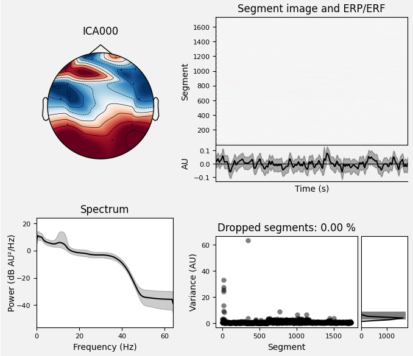

# Midterm Project: Mental Attention States Classification Using EEG Data

# Table of Contents

- [Midterm Project: Mental Attention States Classification Using EEG Data](#midterm-project-mental-attention-states-classification-using-eeg-data)
- [Table of Contents](#table-of-contents)
- [1. Project Overview](#1-project-overview)
  - [1.1. What is EEG?](#11-what-is-eeg)
  - [1.2. Experiment in project](#12-experiment-in-project)
  - [1.3. Dataset](#13-dataset)
  - [1.4. Main stages of the project](#14-main-stages-of-the-project)
- [2. Data Preprocessing](#2-data-preprocessing)
  - [2.1. High-pass filter](#21-high-pass-filter)
  - [2.2. Re-reference (Common Average Reference)](#22-re-reference-common-average-reference)
  - [2.3. Independent Component Analysis](#23-independent-component-analysis)
- [3. Feature Extraction](#3-feature-extraction)
  - [3.1. Fourier Transform](#31-fourier-transform)
  - [3.2. Wavelet Transform](#32-wavelet-transform)
  - [3.3. Deriving Features from the Frequency Domain](#33-deriving-features-from-the-frequency-domain)
- [4. Modeling](#4-modeling)
  - [4.1. Basic Models](#41-basic-models)
    - [4.1.1. Linear Discriminant Analysis (LDA)](#411-linear-discriminant-analysis-lda)
      - [4.1.1.1. Introduction](#4111-introduction)
      - [4.1.1.3. Why LDA Should Be Used for EEG Datasets](#4113-why-lda-should-be-used-for-eeg-datasets)
    - [4.1.2. Logistic Regression](#412-logistic-regression)
      - [4.1.2.1. Theory of Logistic Regression](#4121-theory-of-logistic-regression)
      - [4.1.2.2. Reasons for Choosing Logistic Regression](#4122-reasons-for-choosing-logistic-regression)
    - [4.1.3. Support Vector Machine (SVM)](#413-support-vector-machine-svm)
      - [4.1.3.1. Theory of Linear SVC](#4131-theory-of-linear-svc)
      - [4.1.3.2. Reasons for Choosing Linear SVC](#4132-reasons-for-choosing-linear-svc)
    - [4.1.4. Boosting (LightBGM, XGBooost)](#414-boosting-lightbgm-xgbooost)
      - [4.1.4.1. Gradient Boosting](#4141-gradient-boosting)
      - [4.1.4.2. XGBoost](#4142-xgboost)
      - [4.1.4.3. LightGBM](#4143-lightgbm)
    - [Feature Selection and Training Models](#feature-selection-and-training-models)
      - [1. Introduction](#1-introduction)
      - [2. Code Overview](#2-code-overview)
      - [3. Detailed Explanation](#3-detailed-explanation)
  - [4.2. Advanced Models](#42-advanced-models)
    - [4.2.1. Multi-layer Perceptron (MLP)](#421-multi-layer-perceptron-mlp)
      - [4.2.1.1. Introduction to Multilayer Neural Network](#4211-introduction-to-multilayer-neural-network)
      - [4.2.1.2. Feedforward](#4212-feedforward)
      - [4.2.1.3. Objective Function](#4213-objective-function)
      - [4.2.1.4. Backpropagation](#4214-backpropagation)
      - [4.2.1.5. Why Multi-layer Perceptron (MLP) Should Be Used for EEG Datasets](#4215-why-multi-layer-perceptron-mlp-should-be-used-for-eeg-datasets)
    - [4.2.2. EEGNet](#422-eegnet)
      - [4.2.2.1. Theory of EEGNet](#4221-theory-of-eegnet)
      - [4.2.2.2. Parameters](#4222-parameters)
      - [4.2.2.3. Training](#4223-training)
      - [4.2.2.4. Optimization for EEG Data](#4224-optimization-for-eeg-data)
      - [4.2.2.5. Reasons for Choosing EEGNet for EEG Data in This Task](#4225-reasons-for-choosing-eegnet-for-eeg-data-in-this-task)
- [5. Model Evaluation](#5-model-evaluation)
- [Conclusion](#conclusion)
- [Potential Improvement](#potential-improvement)


# 1. Project Overview

Project **Mental Attention States Classification Using EEG Data**, classify mental attention states (focused, unfocused, drowsy) based on EEG signals using machine learning techniques.

## 1.1. What is EEG?

EEG (Electroencephalogram) is a method of measuring and recording the electrical activity of the brain through electrodes placed on the scalp. These electrical signals reflect the activity of nerve cells in the brain as they transmit information. EEG is commonly used in medicine to diagnose neurological disorders such as epilepsy, dementia, or sleep-related issues, as well as in brain research. The EEG signals are recorded as brain waves with different frequencies and amplitudes, which can be categorized into types such as alpha, beta, delta, and theta waves.

## 1.2. Experiment in project

The experiments were conducted between 6 PM and 7 PM. The details of the experiments are given below (Authors):

Participants controlled a simulated passenger train over a primarily featureless route for a duration of 35 to 55 minutes. Specifically, during the first 10 minutes of each experiment, the participants were engaged in focused control of the simulated train, paying close attention to the simulator’s controls, and following the developments on the screen in detail. During the second 10 minutes of the experiments, the participants stopped following the simulator and became de-focused. The participants did not provide any control inputs during that time and stopped paying attention to the developments on the computer screen; however, they were not allowed to close their eyes or drowse. Finally, during the third 10 minutes of the experiments, the participants were allowed to relax freely, close their eyes and doze off, as desired.

**Experiment pitfall**

The experiment only had 5 subjects, and had been conducted for 7 days. Each record contains one EEG data each subject each day, except for one, who didn't joined in the last day. Hence, there are $7 \times 5 - 1 = 34$ records in total.

Since there are only 5 subjects, the data is hugely biased toward them. If you want to use the result in this report to generalize further, please use it with caution.

## 1.3. Dataset

The dataset used in this study is available for access on Kaggle. It is titled "EEG Data for Mental Attention State Detection" and contains various records related to EEG signals, specifically designed to analyze mental attention states. You can access and download the dataset using the following link: [EEG Data for Mental Attention State Detection on Kaggle](https://www.kaggle.com/datasets/inancigdem/eeg-data-for-mental-attention-state-detection/data).

This dataset consists of 34 experiments designed to monitor the attention state of human participants using passive EEG BCI (Brain-Computer Interface). Each Matlab file in the dataset contains data acquired from an EMOTIV device during a single experiment. The raw data is stored in the variable `o.data`, which is an array of size $\{\text{number-of-samples}\} \times 25$. Each column of `o.data` (i.e., `o.data(:,i)`) corresponds to one data channel.

The sampling frequency of the data is 128 Hz. In `o.data`, it has the list of columns provided below:

| ID   | Channel Name        | Meaning                                                |
| ---- | ------------------- | ------------------------------------------------------ |
| 1    | `'ED_COUNTER'`      | Counter for collected data samples.                    |
| 2    | `'ED_INTERPOLATED'` | Data interpolation state.                              |
| 3    | `'ED_RAW_CQ'`       | Raw data quality from sensors.                         |
| 4–17 | EEG Channels        | Channels containing EEG data (electroencephalography). |
| 18   | `'ED_GYROX'`        | Data from gyroscope sensor (X-axis).                   |
| 19   | `'ED_GYROY'`        | Data from gyroscope sensor (Y-axis).                   |
| 20   | `'ED_TIMESTAMP'`    | Timestamp.                                             |
| 21   | `'ED_ES_TIMESTAMP'` | Event timestamp.                                       |
| 22   | `'ED_FUNC_ID'`      | Function ID code.                                      |
| 23   | `'ED_FUNC_VALUE'`   | Function value.                                        |
| 24   | `'ED_MARKER'`       | Event marker.                                          |
| 25   | `'ED_SYNC_SIGNAL'`  | Synchronization signal.                                |

The experiment was conducted with 5 participants, each performing the experiment over a 7-day period. However, the last participant only completed the experiment in 6 days, resulting in a total of 34 files. Typically, during the first two days, participants familiarize themselves with the experimental process, which makes the data from these two days relatively complex. The data from the following 5 days are more stable. The EEG data we focus on comes primarily from the EEG channels, where the EEG data is stored.

## 1.4. Main stages of the project

This project includes the following main stages: **EDA** (Exploratory Data Analysis), **data preprocessing**, **feature extraction**, **modeling**, and **model evaluation**. In the preprocessing stage, we use a bandpass filter, re-referencing method, and ICA (Independent Component Analysis). For feature extraction, we apply Fourier Transform to convert the data from the time-domain to the frequency-domain in order to extract relevant features.

> ... Viết tiếp phần modeling, cách đánh giá model (overview thôi)

# 2. Data Preprocessing

After extracting data from 14 channels by converting the Matlab files, we proceeded with data processing and filtering. We first applied a high-pass filter, followed by re-referencing using the Common Average Reference (CAR) method. Finally, we used Independent Component Analysis (ICA) to remove noise sources such as blink and muscle artifacts, and employed the LOF (Local Outlier Factor) algorithm for further refinement.

## 2.1. High-pass filter

A high-pass filter is used to remove low-frequency components from the EEG signal, allowing higher frequency components to pass through. This is particularly useful for eliminating slow drifts and other low-frequency noise that can obscure the relevant EEG signals. The high-pass filter is implemented using a Butterworth filter, which is designed to have a flat frequency response in the passband. The filter is characterized by its cutoff frequency (`lowcut`), which determines the threshold below which frequencies are attenuated, and its order, which affects the steepness of the filter's roll-off.

The Butterworth high-pass filter is created using the following steps:
1. **Define the Filter**: The filter is defined by its cutoff frequency and order. The Nyquist frequency (`nyq`) is half the sampling frequency (`fs`), and the normalized cutoff frequency (`low`) is the ratio of the cutoff frequency to the Nyquist frequency.
2. **Design the Filter**: The filter coefficients are computed using the `butter` function, specifying the filter type as "highpass" and the output format as second-order sections (`sos`).
3. **Apply the Filter**: The filter is applied to the data using the `sosfilt` function, which performs the filtering operation along the specified axis of the data array.

This high-pass filtering process helps in enhancing the quality of the EEG signals by removing unwanted low-frequency noise, making it easier to analyze the relevant brain activity.

## 2.2. Re-reference (Common Average Reference)

**Re-referencing** is a preprocessing technique used to improve the quality and consistency of EEG signals by eliminating certain common sources of noise or artifact. In particular, **Common Average Reference (CAR)** is a method where the reference electrode is replaced by the average of all EEG channels in the dataset.

The idea behind CAR is that, in most EEG experiments, all electrodes are measuring similar common-mode noise (e.g., power line interference, or drift). By subtracting the mean of all electrode signals from each individual channel, the common noise is effectively removed, which enhances the signal related to the brain's activity.

For an EEG signal consisting of multiple channels, the **Common Average Reference (CAR)** is computed as the mean of all channels:

$$
\text{CAR} = \frac{1}{N}\sum_{i=1}^{N}x_i
$$

Where:

- $x_i$​ is the signal from the $i$-th channel.
- $N$ is the total number of channels.
- $\text{CAR}$ is the average of all channels' signals.

Each channel's signal is then re-referenced by subtracting the average reference from it:

$$
x'_i = x_i - \text{CAR}
$$

This method ensures that any common-mode artifacts (such as power line noise) are minimized, making the analysis of brain activity more accurate. The approach is widely used in EEG preprocessing to reduce the impact of external interferences that could distort the underlying neural signals.
## 2.3. Independent Component Analysis

ICA finds the independent components (also called factors, latent variables or sources) by maximizing the statistical independence of the estimated components.

The data can be represented by the observed random vector ${\displaystyle {\boldsymbol {x}}=(x_{1},\ldots ,x_{m})^{T}}$ and the hidden components as the random vector ${\displaystyle {\boldsymbol {s}}=(s_{1},\ldots ,s_{n})^{T}.}$ The task is to transform the observed data ${\displaystyle {\boldsymbol {x}},}$ using a linear static transformation ${\displaystyle {\boldsymbol {W}}}$ as ${\displaystyle {\boldsymbol {s}}={\boldsymbol {W}}{\boldsymbol {x}},}$ into a vector of maximally independent components ${\displaystyle {\boldsymbol {s}}}$ measured by some function ${\displaystyle F(s_{1},\ldots ,s_{n})}$ of independence. 

This is used to extract independent components from a signal, which is brain wave in our case. Our hypothesis is the artifact and the underlying brain wave are mixed together, but they are independent on each other, hence we can use ICA to separate them apart. In this project, this is done by using [MNE python](https://mne.tools/stable/index.html).

The artifacts includes, but does not limit to: Heartbeat (ECG), eyeball movement (EOG), muscle movement, cable movement, sweat.

The steps are:
- Using ICA to extract independent components.
- Plot these components. Then we can use our insight to analyze the power spectrum, and the scalp map of each component. A guideline to this subject can be found at https://labeling.ucsd.edu/tutorial/labels.


<center>
    
</center>


However, since ICA is a signal processing algorithm, not a brainwave processing algorithm, it can't tell artifacts and brainwave apart automatically for us. We need to categorize do it manually, or use other algorithms to do it. 
These algorithms come directly from the mentioned library, which are [LOF](https://mne.tools/stable/generated/mne.preprocessing.find_bad_channels_lof.html#mne.preprocessing.find_bad_channels_lof), [find_bads_muscle](https://mne.tools/stable/generated/mne.preprocessing.ICA.html#mne.preprocessing.ICA.find_bads_muscle), and [find_bads_eog](https://mne.tools/stable/generated/mne.preprocessing.ICA.html#mne.preprocessing.ICA.find_bads_eog).

# 3. Feature Extraction

After the data preprocessing step, we applied Fast Fourier Transform (FFT) to convert the data from the time domain to the frequency domain, enabling the extraction of relevant features from the data.

## 3.1. Fourier Transform

In EEG data analysis, we aim to decompose complex signals into their constituent sine waves, each defined by amplitude, frequency, and phase. This is essential, as EEG signals contain overlapping frequencies. The Fourier Transform (FT) helps identify the frequencies present in the signal, their intensity, and their variation over time. According to Fourier’s theorem, any signal $f(t)$ can be expressed as a sum of sine waves:

$$
f(t) = \sum_{n=0}^{\infty} A_n \cos(2 \pi f_n t + \phi_n)
$$

Where:

- $A_n$ is the amplitude.
- $f_n$ is the frequency.
- $\phi_N$ is the phase.

This decomposition is critical for analyzing brain activity and detecting anomalies in EEG data.

To efficiently compute the Fourier Transform, we use the Fast Fourier Transform (FFT), an algorithm that significantly reduces the computational complexity. The FFT allows us to quickly decompose a signal into its frequency components, making it particularly useful for real-time EEG signal processing.

Mathematically, the FFT is a discrete version of the Fourier Transform. For a signal sampled at discrete time intervals, the Fourier Transform becomes:

$$
X_k = \sum_{n=0}^{N-1} x_n e^{-i 2 \pi \frac{k_n}{N}}, k = 0, 1, \dots, N-1
$$

Where:

- $X_k$ represents the frequency components of the signal.
- $x_n$ is the signal value at the $n$-th sample.
- $N$ is the total number of samples.

The FFT algorithm optimizes this summation by taking advantage of symmetries in the calculation, reducing the time complexity from $\mathcal{O}(N^2)$ to $\mathcal{O}(N \log N)$, making it much more feasible for large datasets like EEG.

## 3.2. Wavelet Transform

If Fourier extracts a wave into a sum of sine and cosine waves, Wavelet generalize that into a family of mother function. In this project, we choose Daubechies family, because of its fast computation, allow for quick experimentation.

## 3.3. Deriving Features from the Frequency Domain

With the above two transformations, we convert the EEG data of each channel into the frequency domain, we proceed to extract relevant features for each channel. These features include statistical descriptors such as descriptive statistics, band power, relative power, peak frequencies, spectral entropy, skewness, and kurtosis, which are derived from the Fast Fourier Transform (FFT). Specifically, band power provides insights into the energy distribution across different frequency bands, while relative power normalizes this energy in relation to the total signal. Peak frequencies highlight dominant oscillatory patterns, and spectral entropy quantifies the complexity or randomness of the signal. Skewness and kurtosis offer additional statistical measures that describe the asymmetry and the 'tailedness' of the frequency distribution, respectively.

For the wavelet transform, we extract features such as detail energies and relative energies, all computed from it's coefficients. The wavelet transform is particularly suited for analyzing non-stationary signals, as it allows for time-frequency localization. By selecting an appropriate wavelet (e.g., Daubechies 4, or 'db4'), we can capture both the high-frequency transients and low-frequency components of the EEG signal at different scales, providing a more detailed analysis compared to FFT alone.

As suggested by the author, the following channels are considered to be particularly useful for analysis: 'ED_F7', 'ED_F3', 'ED_P7', 'ED_O1', 'ED_O2', 'ED_P8', and 'ED_AF4'. To simplify the model and reduce computational complexity, feature extraction is applied exclusively to these selected channels.

**Descriptive Statistics**

For the descriptive statistics, we compute the mean, standard deviation, median, maximum, and minimum values for each channel.

**Band Power**

The total power within each frequency band is calculated by integrating the signal's power spectrum over the respective frequency range. This provides a measure of the energy contained in different brainwave frequencies. The frequency bands are defined as follows:

- **Delta (0.5 - 4 Hz):** Associated with deep sleep and restorative processes.
- **Theta (4 - 8 Hz):** Linked to light sleep, relaxation, and meditative states.
- **Alpha (8 - 13 Hz):** Related to relaxed wakefulness and creative thinking.
- **Beta (13 - 30 Hz):** Connected to active thinking, focus, and problem-solving.
- **Gamma (30 - 50 Hz):** Involved in high-level information processing and cognitive functioning.

By analyzing the band power across these frequency bands, we can gain insights into the different states of brain activity.

**Relative Power**

Relative power is a normalized measure of the power within a specific frequency band relative to the total power across all frequency bands. This normalization allows for the comparison of power distribution across different frequency bands, independent of the overall signal strength. By calculating the relative power, we can identify which frequency bands are more dominant in the EEG signal, providing insights into the underlying neural activity. This measure is particularly useful for comparing different conditions or states, as it accounts for variations in the total signal power.

**Peak Frequency**

Peak frequency refers to the frequency at which the power spectrum of the EEG signal reaches its maximum value for each channel. This measure highlights the dominant oscillatory patterns in the signal. By identifying the peak frequencies, we can gain insights into the most prominent neural activities occurring within specific frequency bands. The peak frequencies are determined by finding the frequency corresponding to the highest amplitude in the positive part of the Fast Fourier Transform (FFT) data for each channel.

**Spectral Entropy**

Spectral entropy quantifies the complexity or randomness of the EEG signal's power spectrum. It is a measure derived from information theory, representing the distribution of power across different frequency components. A higher spectral entropy value indicates a more uniform distribution of power, suggesting a more complex or random signal, while a lower value indicates a more concentrated power distribution, suggesting a more regular or predictable signal.

Mathematically, spectral entropy $H$ is calculated as follows:

$$H = -\sum_{i} P_i \log_2(P_i)$$

where $P_i$ is the normalized power of the $i$-th frequency component, obtained by dividing the power spectrum by its total sum. This ensures that $P_i$ represents a probability distribution, allowing the use of the entropy formula.

**Skewness and Kurtosis**

Skewness and kurtosis are statistical measures that describe the shape of the frequency distribution of the EEG signal.

*Skewness* measures the asymmetry of the distribution. A positive skewness indicates that the right tail of the distribution is longer or fatter than the left, while a negative skewness indicates that the left tail is longer or fatter than the right. Mathematically, skewness $S$ is calculated as follows:

$$S = \frac{\frac{1}{n} \sum_{i=1}^{n} (x_i - \bar{x})^3}{\left( \frac{1}{n} \sum_{i=1}^{n} (x_i - \bar{x})^2 \right)^{1.5}}$$

where $x_i$ are the data points, $\bar{x}$ is the mean of the data, and $n$ is the number of data points.

*Kurtosis* measures the "tailedness" of the distribution. A high kurtosis indicates that the distribution has heavy tails and a sharp peak, while a low kurtosis indicates that the distribution has light tails and a flatter peak. Mathematically, kurtosis $K$ is calculated as follows:

$$K = \frac{\frac{1}{n} \sum_{i=1}^{n} (x_i - \bar{x})^4}{\left( \frac{1}{n} \sum_{i=1}^{n} (x_i - \bar{x})^2 \right)^2}$$

where $x_i$ are the data points, $\bar{x}$ is the mean of the data, and $n$ is the number of data points.

By computing skewness and kurtosis for each channel, we can gain insights into the asymmetry and tailedness of the frequency distribution of the EEG signal, respectively.

**Wavelet Transform Features**

The wavelet transform is particularly suited for analyzing non-stationary signals, such as EEG data, as it allows for time-frequency localization. By selecting an appropriate wavelet (e.g., Daubechies 4, or 'db4'), we can capture both the high-frequency transients and low-frequency components of the EEG signal at different scales.

For each channel, the wavelet transform decomposes the signal into multiple levels of detail coefficients. From these coefficients, we extract features such as detail energies and relative energies. 

*Detail energies* are computed by summing the squares of the detail coefficients at each level, providing a measure of the energy contained in different frequency components of the signal.

*Relative energies* are obtained by normalizing the detail energies with respect to the total energy across all levels. This normalization allows for the comparison of energy distribution across different frequency components, independent of the overall signal strength.

By analyzing these wavelet features, we can gain a more detailed understanding of the EEG signal's characteristics compared to using the Fast Fourier Transform (FFT) alone.

# 4. Modeling

## 4.1. Basic Models

### 4.1.1. Linear Discriminant Analysis (LDA)

#### 4.1.1.1. Introduction

Before going into the problem of LDA, I would like to recall the Principal component analysis (PCA) algorithm a bit. PCA is an unsupervised learning method, meaning it uses data vectors without considering class labels, if available. However, in classification tasks, where supervised learning is most common, using class labels can yield better classification results.

**PCA reduces the data dimensions to retain as much information (variance) as possible**. But in many cases, we don't need to preserve all the information—only the relevant data for the task at hand. For example, in a binary classification problem, data can be projected onto different lines, and the projection can impact how easily classes can be separated.


*Figure 1: Data projected onto different lines*

In the example (*Figure 1*), the bell curves represent the probability density functions (pdf) of the data projected onto different lines. The standard normal distribution is used as an approximation, though the data does not have to follow a normal distribution.

The spread of each curve reflects the standard deviation. A narrower spread indicates less dispersion, while a wider spread shows greater dispersion. Projecting data onto $d_1$ results in significant overlap between classes, while projecting onto $d_2$ leads to better separation, making classification more effective.

However, **small standard deviations alone do not guarantee good class separation**. *Figure 2* shows that the distance between class means (expectations) and the total variance impact the discriminability of the data. 


*Figure 2: Class separation based on variance and distance between class means*

- In *Figure 2a)*, both classes have high variance, causing significant overlap.
- In *Figure 2b)*, the variance within each class is small, but the class means are too close, leading to overlap.
- In *Figure 2c)*, both the variance is small and the distance between class means is large, resulting in minimal overlap and better discrimination.

**In LDA, we aim to maximize the ratio of between-class variance to within-class variance.** "Within-class variance" reflects how similar the data points are within each class, such as $s^2_1$ and $s^2_2$, and "between-class variance" reflects how distinct the classes are from each other $(m_1 - m_2)^2$. LDA seeks to find a projection that maximizes this ratio to achieve the best possible separation between classes.

**2. Objective Function in LDA**

Linear Discriminant Analysis (LDA) aims to find a projection that maximizes the separation between classes while minimizing the variation within each class. This is done by finding a projection matrix $W$ that maximizes the ratio of between-class variance to within-class variance. The objective function used in LDA is as follows:

$$J(W) = \frac{W^T S_B W}{W^T S_W W}$$

Where:
- $W$ is the projection vector (or matrix) that maps the data into a lower-dimensional space.
- $S_B$ is the between-class scatter matrix, which measures the variance between different class means and the overall mean of the data.
- $S_W$ is the within-class scatter matrix, which measures the variance within each individual class.

**3. Between-Class Scatter Matrix ($S_B$)**

The **between-class scatter matrix** quantifies the dispersion of the class means from the overall mean of all the classes. In other words, it measures how far apart the different class centers (means) are from the overall mean of the dataset.

The formula for $S_B$ is:

$$S_B = \sum_{i=1}^{C} N_i (\mu_i - \mu)(\mu_i - \mu)^T$$

Where:
- $N_i$ is the number of samples in class $i$.
- $\mu_i$ is the mean of class $i$.
- $\mu$ is the overall mean of all classes.
- $C$ is the total number of classes.

**4. Within-Class Scatter Matrix ($S_W$)**

The **within-class scatter matrix** measures the variance within each class. It is calculated by summing the covariance matrices for each class, which quantify how spread out the data points are within each class.

The formula for $S_W$ is:

$$S_W = \sum_{i=1}^{C} \sum_{x \in X_i} (x - \mu_i)(x - \mu_i)^T$$

Where:
- $X_i$ is the set of data points in class $i$.
- $\mu_i$ is the mean of class $i$.
- $x$ is a data point in class $i$.

**5. Maximizing the Ratio of Between-Class and Within-Class Scatter**

The main objective of Linear Discriminant Analysis (LDA) is to find a projection $W$ that maximizes the separation between different classes while minimizing the variance within each class. This can be achieved by maximizing the ratio of the between-class scatter matrix $S_B$ to the within-class scatter matrix $S_W$. Specifically, the goal is to find the projection direction that makes the classes as distinct as possible, while keeping the spread of points within each class as small as possible.

To find the optimal projection $W$, we solve the eigenvalue problem:

$$S_W^{-1} S_B W = \lambda W$$

Where:
- $S_W^{-1} S_B$ is the matrix we need to solve for, which is a measure of how the between-class variance relates to the within-class variance after applying the inverse of the within-class scatter matrix.
- $W$ represents the eigenvectors (directions of projection) corresponding to the largest eigenvalues, which indicate the most significant directions for maximizing class separability.
- $\lambda$ represents the eigenvalue corresponding to each eigenvector, and the eigenvectors with the largest eigenvalues give the directions that maximize the ratio of between-class to within-class variance.

By solving this eigenvalue problem, we obtain the optimal projection matrix $W$ that transforms the data into a lower-dimensional space where the classes are well-separated and the spread of points within each class is minimized.

After finding the optimal projection matrix $W$, we can project the data onto this lower-dimensional space to perform classification tasks more effectively:

$$Y = XW$$

Where:
- $Y$ is the transformed data in the lower-dimensional space.
- $X$ is the original data.
- $W$ is the optimal projection matrix.

#### 4.1.1.3. Why LDA Should Be Used for EEG Datasets

- **Maximizing Class Separability**
  - Optimizes separation between classes by maximizing the ratio of between-class variance to within-class variance.
  - Enhances discrimination by reducing overlap between different EEG patterns.
  - Ensures robust classification by minimizing intra-class variability.

- **Dimensionality Reduction**
  - Reduces the high dimensionality of EEG data by identifying the most discriminative features.
  - Improves computational efficiency, enabling faster training and real-time inference.
  - Mitigates the curse of dimensionality by preventing overfitting in high-dimensional spaces.

- **Effective Multi-class Classification**
  - Naturally extends to multi-class scenarios using strategies like one-vs-rest.
  - Maintains high discriminative power across multiple classes.
  - Ensures reliable performance in complex EEG classification tasks.

- **Integration with Feature Selection Methods**
  - Enhances accuracy by isolating the most informative features.
  - Reduces noise by eliminating irrelevant or noisy features.
  - Ensures scalability and effectiveness even with large and complex EEG datasets.

### 4.1.2. Logistic Regression

#### 4.1.2.1. Theory of Logistic Regression
Logistic Regression is a machine learning method based on a linear model, commonly used for classification tasks. The goal of Logistic Regression is to predict the probability that a sample belongs to a specific class.

**1. General Equation**: For a multi-class classification problem (multinomial logistic regression), the probability of class $k$ is expressed as:
$$
P(y = k | X) = \frac{e^{\beta_k^T X}}{\sum_{j=1}^{K} e^{\beta_j^T X}}
$$

Where:
- $X$: Feature vector.
- $\beta_k$: Weight vector for class $k$.
- $K$: Number of classes (here, 3: **focused**, **unfocused**, **drowsy**).

**2. Key Characteristics**
- **Probability**: The output is the probability of belonging to each class, always in the range [0, 1], with the sum of probabilities across all classes equal to 1.
- **Loss Function**: Cross-Entropy Loss is used for optimization:
   $$
   \mathcal{L} = - \frac{1}{N} \sum_{i=1}^{N} \sum_{k=1}^{K} y_{ik} \log(P(y_i = k | X_i))
   $$
- **Interpretability**: The coefficient $\beta$ represents the influence of each feature on the classification.

#### 4.1.2.2. Reasons for Choosing Logistic Regression
- **Multi-class Classification**: The data involves three distinct states (**focused**, **unfocused**, **drowsy**), making it suitable for the multi-class handling capabilities of Logistic Regression.
- **Simplicity and Efficiency**: Logistic Regression is a simple yet powerful model, it is computationally inexpensive, making it easy to train and deploy.
- **Interpretability**: The coefficients $\beta$ of Logistic Regression allow us to understand the role of each feature in predicting the states. This is helpful for analyzing behavior or optimizing input data.
- **Linearly Separable Data**: Logistic Regression performs well if the data is linearly separable or near-linear after appropriate feature engineering.
- **Scalability**: Regularization methods (L1, L2) can be easily applied to prevent overfitting in noisy data or datasets with many features.

By leveraging Logistic Regression, the classification problem for focused, unfocused, and drowsy states is addressed efficiently, with interpretability and ease of deployment, providing a solid foundation for future model development or improvement.

### 4.1.3. Support Vector Machine (SVM)

#### 4.1.3.1. Theory of Linear SVC

Support Vector Machine (SVM) is a powerful supervised learning algorithm used for classification tasks. The goal of SVM is to find the optimal hyperplane that maximizes the margin between different classes in the feature space. Linear SVC (Support Vector Classification) is a variant of SVM that uses a linear kernel, making it suitable for linearly separable data.

**1. General Equation**: The decision function for a linear SVC is given by:
$$
f(\mathbf{x}) = \mathbf{w}^T \mathbf{x} + b
$$

Where:
- $\mathbf{x}$: Feature vector.
- $\mathbf{w}$: Weight vector.
- $b$: Bias term.

**2. Key Characteristics**
- **Margin Maximization**: Linear SVC aims to maximize the margin between the decision boundary and the closest data points from each class, known as support vectors.
- **Loss Function**: The objective is to minimize the hinge loss function, which is defined as:
   $$
   \mathcal{L} = \sum_{i=1}^{N} \max(0, 1 - y_i (\mathbf{w}^T \mathbf{x}_i + b)) + \frac{\lambda}{2} ||\mathbf{w}||^2
   $$
   Where:
   - $y_i$: True label of the $i$-th sample.
   - $\mathbf{x}_i$: Feature vector of the $i$-th sample.
   - $\lambda$: Regularization parameter to prevent overfitting.

#### 4.1.3.2. Reasons for Choosing Linear SVC

- **Handling High-Dimensional Data**: EEG data often involves a large number of features. Linear SVC is effective in handling high-dimensional data and can efficiently find the optimal hyperplane for classification.
- **Simplicity and Efficiency**: Linear SVC is computationally efficient and can be trained relatively quickly, making it suitable for large datasets.
- **Robustness to Overfitting**: The regularization parameter in Linear SVC helps prevent overfitting, ensuring that the model generalizes well to unseen data.
- **Interpretability**: The linear decision boundary makes it easier to interpret the model and understand the influence of each feature on the classification.
- **Scalability**: Linear SVC can scale well with the number of samples and features, making it suitable for large EEG datasets.

By leveraging Linear SVC, the classification problem for focused, unfocused, and drowsy states can be addressed efficiently, with a balance between simplicity, interpretability, and performance.

### 4.1.4. Boosting (LightBGM, XGBooost)

Initially, the team planned to experiment with Random Forest, Ada Boosting, and Gradient Boosting. However, the first two algorithms do not currently have GPU-supported libraries, which makes feature selection and training of these algorithms on the massive EEG dataset take an extremely long time.

Therefore, the team decided to only experiment with the dataset on Gradient Boosting using the popular frameworks:
- LightGBM
- XGBoost
#### 4.1.4.1. Gradient Boosting
The _Gradient Boosting_ method shares the same idea as _AdaBoosting_, which is to train weak models sequentially. However, instead of using the model’s error to compute the weight for the training data, we use the residuals. Starting from the current model, we try to build a decision tree that attempts to match the residuals from the previous model. The special thing about this model is that instead of trying to match the target variable values, $y$, we try to match the error values of the previous model. Then, we add the trained model to the prediction function to gradually update the residuals. Each decision tree in the sequence has a very small size with only a few decision nodes, determined by the depth parameter $d$ in the model.

<center>
    
</center>

Assume that $\hat{f}(x)$ is the predicted function from the boosting method applied to the forecasting task with target variable $y$. At the $b$-th model in the forecast sequence - $\hat{f}^b$, we try to match the residuals $r_i$ from the previous decision tree $\hat{f}^{b-1}$. The steps of the algorithm are as follows:

1. Initially, set the prediction function $\hat{f}(\mathbf{x}) = 0$ and the residuals $\mathbf{r}_0 = \mathbf{y}$ for all observations in the training set.

2. Repeat the training process of decision trees sequentially with $b = 1, 2, \dots, B$. Each training round consists of the following sub-steps:

   a. Fit a decision tree $\hat{f}^{b}$ with depth $d$ on the training set $(\mathbf{X}, \mathbf{r}_b)$.

   b. Update $\hat{f}$ by adding the prediction of the decision tree, multiplied by the scaling factor $\lambda$:
   
   $$\hat{f}(\mathbf{x}) = \hat{f}(\mathbf{x}) + \lambda \hat{f}^{b}(\mathbf{x})$$

   c. Update the residuals for the model:

   $$\mathbf{r}_{b+1} := \mathbf{r}_b - \lambda \hat{f}^{b}(\mathbf{x})$$

   The algorithm stops updating when the number of decision trees reaches the maximum threshold $B$ or when all observations in the training set are predicted correctly.
URL của ảnh
3. The final prediction from the model sequence will be the combination of all sub-models:

   $$\hat{f}(\mathbf{x}) = \sum_{b=1}^{B} \lambda \hat{f}^{b}(\mathbf{x})$$

#### 4.1.4.2. XGBoost
XGBoost (Extreme Gradient Boosting) is an algorithm based on [[Gradient Boosting]], but with significant improvements in algorithm optimization, and a combination of software and hardware strength, which helps achieve exceptional results in both training time and resource usage.

XGBoost demonstrates remarkable capabilities:
- Solves regression, classification, ranking, and other user-defined problems effectively.
- High performance (fast training speed, memory optimization)
- Good overfitting prevention (regularization and shrinkage)
- Automatic handling of missing data
- High customization (parameters and loss functions)
- Support for parallel computation (CPU/GPU)
- Good model interpretability (feature importance)
- ...

<center>
    
</center>

Since its first release in 2014, XGBoost has quickly gained popularity and is considered the main algorithm, producing outstanding results and winning top places in Kaggle competitions due to its simplicity and efficiency.

#### 4.1.4.3. LightGBM
Although XGBoost achieves outstanding results, it suffers from long training times, especially with large datasets. In January 2016, Microsoft released the experimental version of LightGBM, which quickly replaced XGBoost as the most popular ensemble algorithm.

<center>
    
</center>

Key improvements of LightGBM over XGBoost include:
- LightGBM uses **histogram-based algorithms** instead of the **pre-sort-based algorithms** commonly used in other boosting tools to find the split point during tree construction. This helps LightGBM speed up training and reduce memory usage. A significant improvement of LightGBM over XGBoost is the inclusion of two algorithms:
  - GOSS (Gradient Based One Side Sampling)
  - EFB (Exclusive Feature Bundling)
  
  These algorithms significantly accelerate the computation process.
  
- LightGBM is based on **leaf-wise** growth, while most other boosting tools are based on **depth-wise** growth. Leaf-wise selects nodes to expand trees based on the overall optimization of the entire tree, while depth-wise only optimizes on the branch currently being considered. Therefore, with a smaller number of nodes, trees built from leaf-wise are generally more optimized than those built from depth-wise.

<center>
    
</center>


One consideration when using LightGBM is that although leaf-wise is very effective, for smaller datasets, trees built with leaf-wise tend to overfit quickly. Therefore, LightGBM provides a hyperparameter `max_depth` to limit this. However, Microsoft recommends using LightGBM on sufficiently large datasets, which is the case for the EEG dataset in this problem.

### Feature Selection and Training Models

#### 1. Introduction

[`training_models.py`](https://github.com/yusnivtr/PRML-MidTerm-Project/blob/main/model_implementation/machine_learning_models/training_models.py) presents an in-depth analysis of a Python script designed for training machine learning models, performing feature selection, and evaluating model performance. The script leverages various libraries, including GPU-accelerated machine learning frameworks, to handle both binary and multi-class classification tasks efficiently. The comprehensive structure of the code ensures scalability, modularity, and ease of maintenance, making it suitable for complex data-driven projects.

#### 2. Code Overview

The provided Python script is structured around a `TrainingModels` class that encapsulates the entire workflow of data preprocessing, feature selection, model training, evaluation, and results exportation. The script utilizes advanced machine learning techniques and libraries to optimize performance and accuracy. Key functionalities include:

- **Data Loading and Preprocessing:** Reading training and testing datasets, encoding labels, and scaling features.
- **Feature Selection:** Implementing PCA, SelectFromModel, and RFE to identify the most relevant features.
- **Model Training:** Training multiple models, including LDA, Logistic Regression, Linear SVC, LightGBM, and XGBoost.
- **Evaluation:** Assessing model performance using metrics such as accuracy, precision, recall, and F1-score.
- **Results Exportation:** Saving evaluation results in CSV and JSON formats for further analysis.

#### 3. Detailed Explanation

**i. Libraries and Imports**

The script imports a variety of libraries essential for data manipulation, machine learning, and performance optimization:

- **Data Handling:**
  - `pandas` and `numpy` for data manipulation and numerical operations.
  - `json` for handling JSON data formats.

- **Machine Learning Models and Tools:**
  - `cuml` library components (`LogisticRegression`, `LinearSVC`, `PCA`, `StandardScaler`) for GPU-accelerated machine learning.
  - `sklearn` modules (`LinearDiscriminantAnalysis`, `SelectFromModel`, `RFE`, `metrics`) for traditional machine learning tasks.
  - `xgboost` and `lightgbm` for gradient boosting frameworks.

- **System Operations:** `os` for handling file paths and directory operations.

**ii. Data Paths and Setup**

The script defines file paths for training and testing datasets, as well as the output directory for saving model results:

```python
PARENT_DIRNAME = os.path.expanduser("~/PRML-MidTerm-Project/")
TRAIN_PATH = os.path.join(PARENT_DIRNAME, "data", "df_train.csv")
TEST_PATH = os.path.join(PARENT_DIRNAME, "data", "df_test.csv")
OUTPUT_PATH = PARENT_DIRNAME + "model_implementation/machine_learning_models/output"
```

These paths ensure that the script can locate the necessary data files and store outputs systematically.

**iii. `TrainingModels` Class**

The `TrainingModels` class is the core component of the script, encapsulating all functionalities related to model training and evaluation.

- Initialization (`__init__`): The constructor initializes the class with training and testing data paths. It performs the following operations:
  - Data Loading: Reads CSV files into pandas DataFrames.
  - Feature and Label Separation: Splits data into features and labels, excluding the 'state' column.
  - Label Encoding: Converts categorical labels into numerical values using a label encoder.
  - Feature Scaling: Applies StandardScaler to normalize feature values.
  - Model Definition: Initializes a dictionary of machine learning models, including LDA, Logistic Regression, Linear SVC, LightGBM, and XGBoost.
  - Result Storage Initialization: Prepares dictionaries to store results for binary and multi-class classification evaluations.

- Feature Selection Methods: The class implements three feature selection techniques to enhance model performance by selecting the most relevant features.
  - Principal Component Analysis (PCA): The `apply_pca` method performs dimensionality reduction using PCA:
    - Purpose: Reduce feature space while retaining variance.
    - Process:
      - Iterates over a range of `n_components` to determine the optimal number of principal components.
      - Transforms training and testing features using PCA.
      - Trains each model on the reduced feature set.
      - Evaluates and stores performance metrics.
  - SelectFromModel: The `apply_selectfrommodel` method selects features based on model importance:
    - Purpose: Select features based on their importance weights as determined by a given model.
    - Process:
      - Fits a SelectFromModel selector using each model to identify important features.
      - Transforms training and testing features to include only selected features.
      - Trains the model on the selected features.
      - Evaluates and stores performance metrics.
  - Recursive Feature Elimination (RFE): The `apply_rfe` method recursively eliminates less important features:
    - Purpose: Identify and retain the most significant features by recursively removing the least important ones.
    - Process:
      - Iterates over a range of feature selection thresholds.
      - Applies RFE with varying numbers of features to select.
      - Trains the model on the reduced feature set.
      - Evaluates and stores performance metrics.
- Evaluation Methods: The class includes methods to evaluate both binary and multi-class classification tasks.
  - Binary Classification Evaluation: The evaluate_binary method performs one-vs-rest binary classification for each unique class label:
    - Converts multi-class labels into binary labels for each class.
    - Applies PCA, SelectFromModel, and RFE for feature selection.
    - Trains and evaluates each model using the selected features.
    - Stores performance metrics in `results_binary`.
  - Multi-class Classification Evaluation: The evaluate_multiclass method handles multi-class classification without binary transformation:
    - Applies PCA, SelectFromModel, and RFE for feature selection.
    - Trains and evaluates each model using the selected features.
    - Stores performance metrics in `results_multiclass`.
- Results Export: The class provides methods to export evaluation results:
  - `export_results_to_csv`:
    - Consolidates results from binary and multi-class evaluations.
    - Calculates averages and standard deviations for performance metrics.
    - Exports the consolidated data to CSV files.
  - `save_results`: Saves detailed results, including best methods and classification results, to JSON files for structured storage and later analysis.
- Running the Process: The run method orchestrates the entire workflow:
  1. Binary Classification Evaluation: Initiates evaluation for binary classification tasks.
  2. Multi-class Classification Evaluation: Initiates evaluation for multi-class classification tasks.
  3. Exporting Results: Saves evaluation metrics to CSV files.
  4. Saving Results: Saves detailed evaluation data to JSON files.
  
  This method ensures a streamlined execution of all processes, from data loading to result storage.

**iv. Significance and Impact**

The significance of this script lies in its comprehensive approach to machine learning workflows. By integrating advanced feature selection techniques with multiple robust models, it ensures:
- Enhanced Model Performance: Selecting the most relevant features reduces noise and improves the accuracy and efficiency of models.
- Scalability: The use of GPU-accelerated libraries like cuml allows the handling of large datasets and complex computations efficiently.
- Flexibility: The modular structure permits easy addition of new models or feature selection methods, catering to evolving project requirements.
- Reproducibility: Systematic data handling and result storage facilitate reproducible research and consistent performance evaluations.
The impact extends to industries and research fields where data-driven decision-making is paramount, offering a reliable tool for extracting actionable insights from complex datasets.

## 4.2. Advanced Models

### 4.2.1. Multi-layer Perceptron (MLP)

#### 4.2.1.1. Introduction to Multilayer Neural Network

A multilayer neural network is a neural network with many layers, which is responsible for approximating the relationship between pairs of relations $(x, y)$ in the training set with a function of the form:

$$\mathbf{y}\approx g^{(l)}(g^{(l - 1)}(\ldots(g^{(2)}(g^{(1)}(\mathbf{x})))))$$

In which, $l$ is the number of layers $(1\leq l\leq L)$, $\mathbf{x}$ is the feature vector and $\mathbf{y}$ is the label vector. The function $g$ will be defined based on the matrix of vectors $\mathbf{a}$, and $\mathbf{a}_i$ is the output based on the input of the previous layer $(i\neq 0)$:

$$g^{(l)}(\mathbf{a}^{(l-1)}) = f^{(l)}\left(\mathbf{W}^{(l)^T}\mathbf{a}^{(l-1)} + \mathbf{b}^{(l)}\right)$$ 

where $\mathbf{W}^{(l)}, \mathbf{b}^{(l)}$ are the matrix of weight vectors and bias vectors corresponding to the $l^{th}$ layer, respectively, $f^{(l)}$ is the activation function.


_Figure 1: MLP with two hidden layers (hidden biases)_

#### 4.2.1.2. Feedforward

The output of this type of multilayer neural network for an input $\mathbf{x}$ can be calculated as:

$$
\begin{align*}
    \mathbf{a}^{(0)} &= \mathbf{x} \newline
    z_{i}^{(l)} &= \mathbf{w}_i^{(l)T}\mathbf{a}^{(l-1)} + b_i^{(l)} \newline
    \mathbf{z}^{(l)}  &= \mathbf{W}^{(l)T}\mathbf{a}^{(l-1)} + \mathbf{b}^{(l)},~~ l =  1, 2, \dots, L \newline
    \mathbf{a}^{(l)} &= f(\mathbf{z}^{(l)}), ~~ l =  1, 2, \dots, L \newline
    \mathbf{\hat{y}} &= \mathbf{a}^{(L)}
\end{align*}
$$


_Figure 2: Feedforward in MLP_

This is the predicted output. This step is called feedforward because the computation is performed from the beginning to the end of the network. The satisfaction loss function reaches a small value when this output is close to the true output. Depending on the problem, whether it is classification or regression, we need to design appropriate loss functions.

#### 4.2.1.3. Objective Function

The objective function of the neural network is to minimize the loss function. The loss function is a measure of the difference between the predicted output and the true output. The loss function is defined as:

$$J(\mathbf{W, b, X, Y}) = \frac{1}{N}\sum_{n=1}^N || \mathbf{y}_n - \mathbf{\hat{y}}_n||_2^2 = \frac{1}{N}\sum_{n=1}^N || \mathbf{y}_n - \mathbf{a}_n^{(L)}||_2^2$$

where $N$ is the number of data pairs $(\mathbf{x, y})$ in the training set. 

According to these formulas, direct calculation of derivative values ​​is extremely complicated because the loss function does not directly depend on the coefficient matrices and bias vectors. The most commonly used method is called **backpropagation** which helps calculate the inverse derivative from the last layer to the first layer. The last layer is calculated first because it is closer to the predicted output and loss function.

#### 4.2.1.4. Backpropagation

Set $\mathbf{e}^{(l)} = [e_1^{(l)}, e_2^{(l)}, \ldots, e_{d^{(l)}}^{(l)}]^T \in \mathbb{R}^{d^{(l)}\times 1}$, with $e_i^{(l)} = \dfrac{\partial J}{\partial z_i^{(l)}} = \dfrac{\partial J}{\partial a_i^{(l)}}\dfrac{\partial a_i^{(l)}}{\partial z_i^{(l)}}$. The derivative of the activation function is calculated as follows:

1. _Feedforward_ step: With 1 input value $\mathbf{x}$, calculate the output value of the network. During the calculation process, save the activation values $​\mathbf{a}^{(l)}$ at each layer.
  $$\mathbf{a}^{(0)} = \mathbf{x}; \ \ \mathbf{z}^{(l)} = \mathbf{W}^{(l)T}\mathbf{a}^{(l-1)} + \mathbf{b}^{(l)}; \ \ \mathbf{a}^{(l)} = f(\mathbf{z}^{(l)})$$
1. With output layer (last layer $L$), calculate:
$$\mathbf{e}^{(L)} = \nabla_{\mathbf{z}^{(L)}} J\in\mathbb{R}^{d^{(L)}}; \ \ \nabla_{\mathbf{W}^{(L)}} J = \mathbf{a}^{(L-1)}\mathbf{e}^{(L)^T}\in\mathbb{R}^{d^{(L-1)}\times d^{(L)}}; \ \ \nabla_{\mathbf{b}^{(L)}} J = \mathbf{e}^{(L)}$$
1. With $l = L-1, L-2, \ldots, 1$, calculate:
$$\mathbf{e}^{(l)} = \left( \mathbf{W}^{(l+1)} \mathbf{e}^{(l+1)} \right) \odot f’(\mathbf{z}^{(l)})\in\mathbb{R}^{d^{(l)}}$$
where $\odot$ is the element-wise product or Hadamard product, which means taking each component of the two vectors and multiplying them together to get the result vector.

1. Update derivatives for weight matrix and bias vector at each layer:
$$\nabla_{\mathbf{W}^{(l)}} J = \mathbf{a}^{(l-1)}\mathbf{e}^{(l)^T}\in\mathbb{R}^{d^{(l-1)}\times d^{(l)}}; \ \ \nabla_{\mathbf{b}^{(l)}} J = \mathbf{e}^{(l)}$$

These gradients are then used to update the weights and biases in the direction that minimizes the loss function, typically using an update rule such as:

$$\mathbf{W}^{(l)} := \mathbf{W}^{(l)} - \alpha \nabla_{\mathbf{W}^{(l)}} J$$
$$\mathbf{b}^{(l)} := \mathbf{b}^{(l)} - \alpha \nabla_{\mathbf{b}^{(l)}} J$$

where $\alpha$ is the learning rate, controlling the step size during optimization.


_Figure 3: An example of Backpropagation with one hidden layer in MLP_

#### 4.2.1.5. Why Multi-layer Perceptron (MLP) Should Be Used for EEG Datasets

- **Ability to Model Non-linear Relationships**:
  - **Capturing Complex Patterns:** EEG data often contains intricate, non-linear relationships between features. MLPs, with their multiple hidden layers and non-linear activation functions, are adept at modeling these complex interactions.
  - **Enhanced Predictive Power:** By leveraging non-linear transformations, MLPs can achieve higher accuracy in classification tasks compared to linear models like LDA.

- **Handling High-Dimensional EEG Data**:
  - **Scalability:** EEG datasets typically involve a large number of features (e.g., multiple electrodes over time). MLPs can efficiently process and learn from high-dimensional data without significant loss in performance.
  - **Dimensionality Reduction Integration:** When combined with techniques like PCA or feature selection, MLPs can further enhance their ability to manage and interpret high-dimensional EEG data.

- **Automatic Feature Extraction**
  - **Learning Hierarchical Representations:** MLPs can automatically learn and extract relevant features from raw EEG data through their layered structure, reducing the need for manual feature engineering.
  - **Adaptability:** This automatic feature extraction allows MLPs to adapt to various EEG signal patterns, making them versatile for different classification tasks.

- **Flexibility in Network Architecture**
  - **Customizable Layers and Neurons:** MLPs offer flexibility in designing the number of hidden layers and neurons per layer, allowing for tailored architectures that best fit the specific characteristics of EEG datasets.
  - **Activation Functions:** The choice of activation functions (e.g., ReLU, sigmoid, tanh) can be optimized to improve learning efficiency and model performance for EEG classification.

- **Adaptability to Real-time Applications**
  - **Fast Inference:** Once trained, MLPs can perform rapid inference, making them suitable for real-time EEG monitoring and brain-computer interface applications.
  - **Continuous Learning:** MLPs can be updated with new data, allowing them to adapt to changing EEG patterns over time without the need for complete retraining.

### 4.2.2. EEGNet

#### 4.2.2.1. Theory of EEGNet

**EEGNet** is a specialized Convolutional Neural Network (CNN) designed specifically for processing EEG (Electroencephalography) data. It is characterized by:

- **Lightweight Architecture**: EEGNet is optimized for efficiency, particularly when working with EEG data, which has a high temporal resolution and typically a limited number of channels.
  
- **Key Architectural Components**:
  
  - **Input Shape**: The input data has the shape $(\text{Chans}, \text{Samples}, 1)$, where:
    - `Chans`: Number of EEG channels (electrodes).
    - `Samples`: Number of temporal samples per channel.
    - `1`: The single-channel input dimension.
  
  - **Block 1**:
    - **Temporal Feature Extraction**: A $\text{Conv2D}$ layer with filters $F_1$ and kernel length $\text{kernLength}$ is used to extract temporal patterns from each channel. The output shape is $(\text{Chans}, \text{Samples}, F_1)$.
    - **Spatial Feature Extraction**: A $\text{DepthwiseConv2D}$ layer captures inter-channel relationships by applying depthwise convolution. A depth multiplier $D$ is used to control the number of spatial filters. Output shape: $(1, \text{Samples}, F_1 \times D)$.
    - **Normalization**: Batch Normalization stabilizes and accelerates the learning process. The formula for normalization is:
      
      $$\hat{x}_i = \frac{x_i - \mu}{\sqrt{\sigma^2 + \epsilon}}$$
      
      Where:
      - $\mu$: Batch mean.
      - $\sigma^2$: Batch variance.
      - $\epsilon$: Small constant for numerical stability.
    
    - **Scaling and Shifting**: The normalized values are scaled and shifted using:
      
      $$y_i = \gamma \hat{x}_i + \beta$$
      
      Where $\gamma$ and $\beta$ are learnable parameters.
    
    - **Activation (ELU)**: The Exponential Linear Unit (ELU) introduces non-linearity, improving learning for inputs near 0. The formula is:
      
      $$f(x) =
      \begin{cases}
      x, & \text{if } x > 0 \\
      \alpha (e^x - 1), & \text{if } x \leq 0
      \end{cases}$$
      
      Where $\alpha$ (typically 1) controls saturation for negative values.
    
    - **Pooling**: Reduces spatial dimensions by averaging data points. Output shape: $(1, \text{Samples}/4, F_1 \times D)$.
    - **Dropout**: Randomly removes some elements to prevent overfitting. In EEGNet, the default $\text{dropoutRate} = 0.5$.
    
    - **Output of Block 1**: The down-sampled data has the shape $(1, \text{Samples}/4, F_1 \times D)$.
  
  - **Block 2**:
    - **Separable Convolution**: A $\text{SeparableConv2D}$ layer integrates both spatial and temporal features from **Block 1** by using separable convolutions. This refines the learned representations while maintaining computational efficiency.
    - **Normalization, Activation, Pooling, and Dropout**: These steps help stabilize learning and enhance feature selection for classification.
    - **Output of Block 2**: The data is further down-sampled, with the shape $(1, \text{Samples}/16, F_2)$.

  - **Final Layers**:
    - **Flatten**: Converts the data into a one-dimensional vector. Output shape: $(\text{Samples}/16 \times F_2)$.
    - **Dense**: Aggregates the features and computes logits for the output classes. Each output class $j$ is computed as:
      
      $$y_j = \sum_{i=1}^n z_i W_{ij} + b_j$$
      
      Where:
      - $z_i$: Input features from the Flatten layer.
      - $W_{ij}$: Trainable weights connecting $z_i$ to $y_j$.
      - $b_j$: Bias term for class $j$.
      - $y_j$: Logits for class $j$ before applying Softmax.
      - $n = \text{Samples}/16 \times F_2$: Size of the input vector.

    The **norm rate** is enforced on the weight matrix $W$ to ensure:
      
      $$||W_j||_2 \leq 0.25$$
      
      (In EEGNet, $\text{norm rate} = 0.25$ by default).
    
    - **Softmax**: Converts logits into probabilities for classification. The formula for softmax is:
      
      $$P(y_j) = \frac{e^{y_j}}{\sum_{k=1}^{nb\_classes} e^{y_k}}$$
      
      Where:
      - $P(y_j)$: Probability of class $j$.
      - $\text{nb\_classes} = 3$: Number of classification categories (Focused, Unfocused, Drowsy).
      - The sum of probabilities for all classes is always 1.

  - **Final Output**: Probabilities for each class, with shape $(\text{nb\_classes})$.

#### 4.2.2.2. Parameters

- `nb_classes`: Number of output classes to classify.
- `Chans`, `Samples`: Number of EEG channels and temporal samples.
- `kernLength`: Length of temporal convolution in the first layer.
- `F_1`, `F_2`: Number of temporal and pointwise filters to learn (Default: $F_1 = 8$, $F_2 = F_1 \times D$).
- `D`: Number of spatial filters to learn within each temporal convolution (Default: $D = 2$).
- `norm_rate`: Limitation on kernel weights in the Dense layer to avoid overfitting.
- `dropoutRate`: Dropout fraction.
- `dropoutType`: Randomly removes neurons to prevent overfitting.

#### 4.2.2.3. Training

- **Optimizer**: Adam with an adaptive learning rate for efficient convergence.
- **Loss**: Categorical Cross-Entropy for multi-class classification.
- **Batch Size**: 32, Epochs: 50.
- **Validation Set**: Used to monitor and improve model performance during training.

#### 4.2.2.4. Optimization for EEG Data

The use of **Depthwise and Separable Convolutions** ensures a balance between computational efficiency and the ability to learn spatiotemporal features from EEG data.

#### 4.2.2.5. Reasons for Choosing EEGNet for EEG Data in This Task

- **Tailored for EEG Data**: The compact architecture processes EEG data efficiently, capturing both temporal and spatial patterns crucial for classifying psychological states.

- **Suitability for EEG Data**:
    - EEG data typically features a small number of channels but large timepoints. EEGNet is designed to process such data using specialized convolutional operations.
    - For classifying the three states (focused, unfocused, drowsy), EEGNet can learn both spatial features (across channels) and temporal features (patterns over time).

- **Good Generalization**: EEGNet has been tested on various EEG datasets, showing its ability to generalize well for EEG-based classification tasks.

- **Ease of Customization**: Parameters like `F_1`, `F_2`, `D`, and `kernLength` can be tuned to match dataset characteristics, making it suitable for tasks like classifying focused, unfocused, and drowsy states.

- **Computational Efficiency**: EEGNet's compact design saves computational resources and reduces training time.

- **Relevance to the Task**: Psychological states are often represented by changes in EEG frequency bands. EEGNet, which captures both frequency and spatial information, is optimal for this task.

# 5. Model Evaluation

# Conclusion

# Potential Improvement

As this is just a small project, there are many ways to improve this further. Some can be:
- Add more fields to the data, such as ocular channel, EMG, ... to help filter the artifacts in the data.
- Try band-pass filter instead of high-pass filter.
- Try to add Norch filter.
- Experiment with other Wavelet family function, such as Haar, Biorthogonal, Coiflets, Symlets, Morlet, Mexican Hat, Meyer
- Choose the ICA demonstrates the artifacts manually instead of automatically, since if we had domain knowledge, it could have been much better.
- Experiment with ARIMA family model.
- Use a more sophisticated DL architecture, such as LSTM, transformer, VGGNet,...