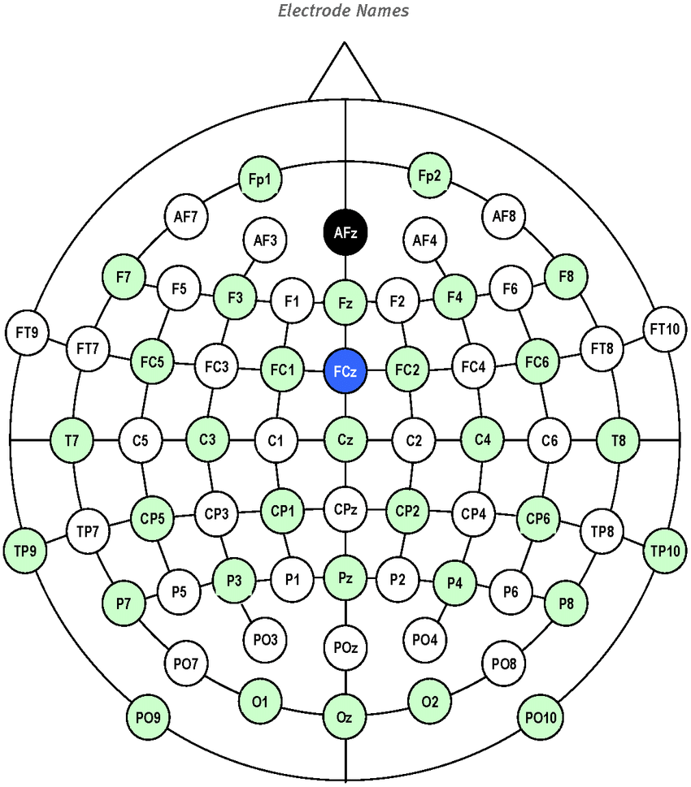

# PRML-MidTerm-Project

## Group Members

| Student ID | Student Name         |
| ---------- | -------------------- |
| 22110063   | Hồ Quốc Nhân Hòa     |
| 22110195   | Đào Xuân Tân         |
| 22110202   | Lý Quang Thắng       |
| 22110245   | Lê Phú Trường        |
| 22110263   | Trần Lê Hữu Vinh     |

## Project Tree

```
├───data
│   ├───preprocessed                    # Directory stores preprocessed data (filtered and features extracted).
│   └───raw                             # Directory stores raw data.
├───preprocessing
│    └───*.py                           # Scripts for preprocessing and features engineering tasks.
├───data_preprocessing.ipynb            # Notebook for illustrate preprocessing task.
├───features_engineering.ipynb          # Notebook for illustrate features engineering task.
├───ica.ipynb                           # Notebook for illustrate ICA.
└───model_implementation
    ├───machine_learning_models
    │   ├───output/                     # Evaluation results after training of each Classical Machine Learning Model.
    │   ├──training_models.py           # Script to train all machine learning models.
    │   └──select_best_model.py         # Script to select the best model corresponding to the highest F1-Score .
    └───deep_learning_models            
        └───notebooks
             |───EEGNet.ipynb           # EEGNet implementation and training.
             └───MLP_Model.ipynb        # MLP implementation and training.
```

## Summarization of EEG: 
- A technique to measure the neurons' voltage near the sculp of the object.
- In this project, we are looking at 14 electrode channels. The list of names can be found at [constants.py](./preprocessing/constants.py)
- Below is the image contains the full list of available electrodes
  
<center>
    
    <p><strong>Fig 1:</strong> ICA component information, using MNE python</p>
</center>


## Dataset

The dataset used in this study is available for access on Kaggle. It is titled "EEG Data for Mental Attention State Detection" and contains various records related to EEG signals, specifically designed to analyze mental attention states. You can access and download the dataset using the following link: [EEG Data for Mental Attention State Detection on Kaggle](https://www.kaggle.com/datasets/inancigdem/eeg-data-for-mental-attention-state-detection/data).

This dataset consists of 34 experiments designed to monitor the attention state of human participants using passive EEG BCI (Brain-Computer Interface). Each Matlab file in the dataset contains data acquired from an EMOTIV device during a single experiment. The raw data is stored in the variable `o.data`, which is an array of size $\{\text{number-of-samples}\} \times 25$. Each column of `o.data` (i.e., `o.data(:,i)`) corresponds to one data channel.

The sampling frequency of the data is 128 Hz. In `o.data`, it has the list of columns provided below:

| ID   | Channel Name        | Meaning                                                |
| ---- | ------------------- | ------------------------------------------------------ |
| 1    | `'ED_COUNTER'`      | Counter for collected data samples.                    |
| 2    | `'ED_INTERPOLATED'` | Data interpolation state.                              |
| 3    | `'ED_RAW_CQ'`       | Raw data quality from sensors.                         |
| 4–17 | EEG Channels        | Channels containing EEG data (electroencephalography). |
| 18   | `'ED_GYROX'`        | Data from gyroscope sensor (X-axis).                   |
| 19   | `'ED_GYROY'`        | Data from gyroscope sensor (Y-axis).                   |
| 20   | `'ED_TIMESTAMP'`    | Timestamp.                                             |
| 21   | `'ED_ES_TIMESTAMP'` | Event timestamp.                                       |
| 22   | `'ED_FUNC_ID'`      | Function ID code.                                      |
| 23   | `'ED_FUNC_VALUE'`   | Function value.                                        |
| 24   | `'ED_MARKER'`       | Event marker.                                          |
| 25   | `'ED_SYNC_SIGNAL'`  | Synchronization signal.                                |

The experiment was conducted with 5 participants, each performing the experiment over a 7-day period. However, the last participant only completed the experiment in 6 days, resulting in a total of 34 files. Typically, during the first two days, participants familiarize themselves with the experimental process, which makes the data from these two days relatively complex. The data from the following 5 days are more stable. The EEG data we focus on comes primarily from the EEG channels, where the EEG data is stored.

## Preprocessing and Features Extraction Task

After extracting data from 14 channels by converting the Matlab files, we proceeded with data processing and filtering. We first applied a high-pass filter, followed by re-referencing using the Common Average Reference (CAR) method. Finally, we used Independent Component Analysis (ICA) to remove noise sources such as blink and muscle artifacts, and employed the LOF (Local Outlier Factor) algorithm for further refinement.

After the data preprocessing step, we applied Fast Fourier Transform (FFT) to convert the data from the time domain to the frequency domain, enabling the extraction of relevant features from the data.

You can find the full instruction at this [README](preprocessing/README.md) in folder `preprocessing`.

You should run this task first.

## Modeling

Employed a stratified data splitting approach for training and validation. The modeling phase incorporated a diverse range of machine learning algorithms:
- Classical Machine Learning Models:
  * Logistic Regression
  * LinearSVC
  * LinearDiscriminantAnalysis
  * LightGBM
  * XGBoost
- Deep Learning Models:
  * Multi-Layer Perceptron
  * EEGNet neural network architecture

- You can find the full instruction about Classical Machine Learning at this [README](model_implementation/machine_learning_models/README.md) in folder `model_implementation/machine_learning_models`.

- You can find the full instruction about Deep Learning Models at this [README](model_implementation/deep_learning_models/README.md) in folder `model_implementation/deep_learning_models`.

## Evaluation

### Classical Machine Learning Models

<div align="center">

| Label                | Logistic Regression | SVM Linear                                               | XGBoost                                                  | LDA    | LightGBM                                                 |
| -------------------- | ------------------- | -------------------------------------------------------- | -------------------------------------------------------- | ------ | -------------------------------------------------------- |
| **Binary-focused**   | 0.9987              | <span style="color:green; font-weight:bold;">1.00</span> | <span style="color:green; font-weight:bold;">1.00</span> | 0.9526 | <span style="color:green; font-weight:bold;">1.00</span> |
| **Binary-unfocused** | 0.8456              | 0.914                                                    | <span style="color:green; font-weight:bold;">1.00</span> | 0.7215 | <span style="color:green; font-weight:bold;">1.00</span> |
| **Binary-drowsy**    | 0.9988              | 0.9999                                                   | <span style="color:green; font-weight:bold;">1.00</span> | 0.9701 | <span style="color:green; font-weight:bold;">1.00</span> |
| **Multi-Class**      | 0.9989              | 0.9964                                                   | <span style="color:green; font-weight:bold;">1.00</span> | 0.9116 | 0.2942                                                   |
| **Average**          | 0.9605              | 0.9771                                                   | <span style="color:green; font-weight:bold;">1.00</span> | 0.8890 | 0.8590                                                   |
| **Std**              | 0.0613              | 0.0303                                                   | 0.00                                                      | 0.0974 | 0.3343                                                   |


</div>

### Deep Learning Models

The evaluation metrics for the **MLP** model are as follows:

<div align="center">

| Metric    | Drowsy | Focused | Unfocused | Macro Avg | Weighted Avg |
| --------- | ------ | ------- | --------- | --------- | ------------ |
| Precision | <span style="color:green; font-weight:bold;">1.00</span>   | 0.98    | 0.98      | 0.99      | 0.99         |
| Recall    | <span style="color:green; font-weight:bold;">1.00</span>   | 0.99    | 0.97      | 0.99      | 0.99         |
| F1-Score  | <span style="color:green; font-weight:bold;">1.00</span>   | 0.99    | 0.98      | 0.99      | 0.99         |

</div>

The evaluation metrics for the **EEGNet** model are as follows:

<div align="center">

| Metric    | Drowsy | Focused | Unfocused | Macro Avg | Weighted Avg |
| --------- | ------ | ------- | --------- | --------- | ------------ |
| Precision | <span style="color:green; font-weight:bold;">1.00</span>   | <span style="color:green; font-weight:bold;">1.00</span>    | 0.98      | 0.99      | <span style="color:green; font-weight:bold;">1.00</span>         |
| Recall    | <span style="color:green; font-weight:bold;">1.00</span>   | 0.99    | <span style="color:green; font-weight:bold;">1.00</span>      | <span style="color:green; font-weight:bold;">1.00</span>      | <span style="color:green; font-weight:bold;">1.00</span>         |
| F1-Score  | <span style="color:green; font-weight:bold;">1.00</span>   | <span style="color:green; font-weight:bold;">1.00</span>    | 0.99      | 0.99      | <span style="color:green; font-weight:bold;">1.00</span>         |

</div>

## Conclusion

The project demonstrated the feasibility of classifying mental attention states—focused, unfocused, and drowsy—using EEG data through machine learning and deep learning models. The data preprocessing, including filtering, re-referencing, and Independent Component Analysis (ICA), successfully prepared the EEG signals for feature extraction. Fourier Transform and Wavelet Transform enabled the conversion of time-domain signals into frequency-domain features, while statistical descriptors further enhanced the analysis.

Although the results exceeded expectations, with many models achieving near-perfect accuracy, the team remains somewhat skeptical about the findings. We hope to test the models on real-world data to validate their accuracy. Additionally, ICA did not fully optimize noise filtering, particularly for noise caused by head movement. This is likely due to the lack of critical information from channels such as EOG, ECG, and cHPI in the dataset.

## Potential Improvement

As this is just a small project, there are many ways to improve this further. Some can be:

- Add more fields to the data, such as ocular channel, EMG, ... to help filter the artifacts in the data.
- Try band-pass filter instead of high-pass filter.
- Try to add Norch filter.
- Experiment with other Wavelet family function, such as Haar, Biorthogonal, Coiflets, Symlets, Morlet, Mexican Hat, Meyer.
- Choose the ICA demonstrates the artifacts manually instead of automatically, since if we had domain knowledge, it could have been much better.
- Reorganize the way Machine Learning Models training works, such as exporting files, splitting validation sets, expanding more models, etc.
- Find out the anomalies in the data, as the accuracy of the models used here is often very high.
- Experiment with ARIMA family model.
- Use a more sophisticated DL architecture, such as LSTM, transformer, VGGNet,...